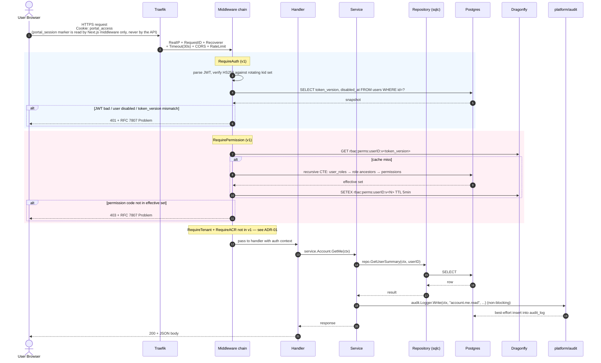

# v1 authenticated request flow

A simplified version of `diagrams.md` §4, with the v1 cut applied. The full long-horizon diagram shows 5 middleware layers (RequireAuth → RequireTenant → RequireACR → RequirePermission → handler); v1 ships only 2 of them (RequireAuth, RequirePermission). Tenant and step-up auth land in later phases.

## Notes

- **The two-channel revocation works without RequireTenant.** Bumping `users.token_version` invalidates every cached permission set (key namespaced by `v<N>`) AND every issued access token (re-fetched on every request). v1 inherits both behaviours.
- **RequireTenant lands in Phase 1.** Once it does, every protected route's chain becomes `RequireAuth → RequireTenant → RequirePermission → handler`. v1's lack of tenant is intentional (see [ADR-01](../01-v1-scope-cut.md)); existing handlers don't need to be aware of the tenant context until then.
- **RequireACR (step-up) is reserved.** [D-27] requires bank-sensitive operations to gate on a fresh MFA. Bank is not v1, so the middleware isn't wired. Since [ADR-06](../06-local-auth-model.md) (local password auth) the access token carries no `amr` / `acr` / `auth_time` claims; they will be introduced together with MFA/step-up, so RequireACR can land later without rewriting the middleware chain.
- **The audit step is best-effort.** Per CLAUDE.md, `audit.Logger.Write` swallows errors and never blocks the request. A DB hiccup in audit_log must not 500 the user's request. Don't make handlers depend on the return value.
- **RBAC cache TTL is 5 minutes.** Combined with `token_version` namespacing, the worst-case revocation latency is `min(remaining JWT TTL, 5 min)` for cached permissions and instant for new requests post-bump. Aligned with the access-token TTL of 5 minutes.

## What changes when each later phase lands

| Phase | Change to this diagram |
| --- | --- |
| Phase 1 (tenancy) | Insert `RequireTenant` between RequireAuth and RequirePermission. Adds `SET LOCAL app.tenant_id` GUC on the request tx so RLS filters every query downstream. |
| Phase 5 prereq | Insert `RequireACR("acr:portal:recent_mfa")` on bank-sensitive routes only. Returns 403 + `step_up_required` Problem if `acr` claim is insufficient; frontend redirects to MFA prompt. |
| Phase 6 (notifications) | Service layer emits `notify:*` Asynq tasks after writes. No change to the middleware chain. |
| Phase 1.5+ (RBAC layer) | RequirePermission gains an extra resolution step: walk user_policy_attachments + group_policy_attachments before the role union; apply file-gate filter before the deny check. See [ADR-02](../02-rbac-model-reconciliation.md). |
