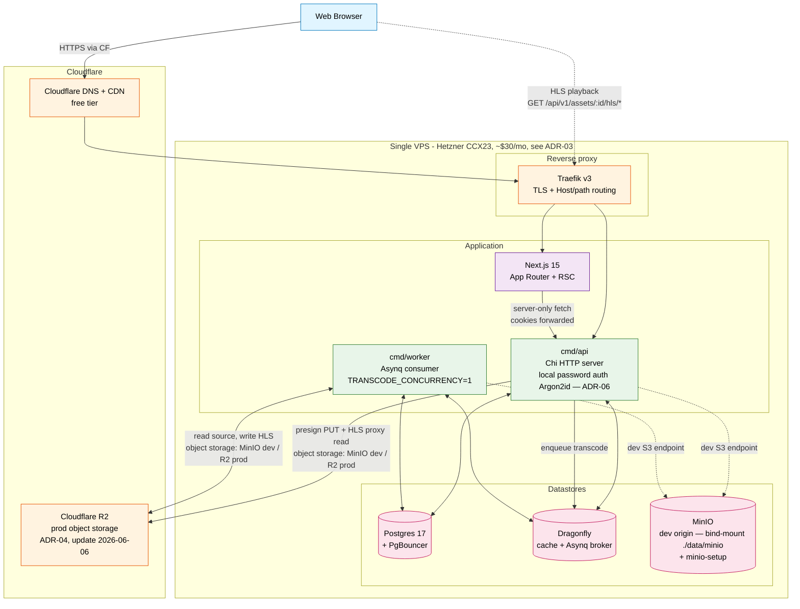

# v1 system landscape

> **Status:** reflects the shipped v1 stack as of **2026-07-06** — 8 compose services (postgres, pgbouncer, dragonfly, minio + minio-setup, traefik, api, worker, frontend). Auth is local-password per [ADR-06](../06-local-auth-model.md).

The sparse version of `diagrams.md` §1, scoped to what actually runs in the [v1 cut](../01-v1-scope-cut.md). Everything greyed-out in the long-horizon diagram (LiveKit, mediamtx, observability stack) is omitted here so the picture matches what the compose stack actually starts. MinIO appears because dev runs it as the S3 endpoint (prod = R2).



## What's missing on purpose

| Greyed-out in this diagram | Why deferred | Reintroduce in |
| --- | --- | --- |
| MinIO as a **prod** origin tier | Dev already runs MinIO as the S3 endpoint; deployed envs stay R2-only per the [ADR-04](../04-storage-tier-budget.md) update (2026-06-06) | Phase X when first sovereignty-sensitive operator appears |
| Observability stack (Loki/Prometheus/Tempo/Grafana/GlitchTip) | RAM + RAM + RAM; demo uses container logs | Phase 0.5 — recommended before any external user |
| mediamtx (live ingest) | Live streaming is feature.md §9.25 / Phase 10 | Phase 10 |
| LiveKit + coturn (calls) | Voice/video is feature.md §9.37 / Phase 12 | Phase 12 |
| `cmd/sysjobs` (cross-tenant batch) | No multi-tenant data in v1; nothing to batch over | Phase 1 (tenancy) |
| Web Push (VAPID) | Notification module is Phase 6 | Phase 6 |
| Stripe Connect (payouts) | Creator economy is Phase 11 | Phase 11 |

## v1 happy-path flows

The two flows v1 must demonstrate:

### Flow A — Local password sign-in

```
Browser → Traefik → Next.js /login page
       → POST /api/v1/auth/login {email, password, remember}
       → API rate-limits (Redis brute-force limit + lockout), verifies Argon2id hash (constant-time), checks disabled_at
       → issues JWT access (5 min) + refresh token, sets portal_access / portal_refresh / portal_session cookies
       → Browser lands authenticated
```

`POST /auth/register` returns **201 with no session** — the user goes back to `/login`. There is no `/auth/callback`, `state`, or `nonce` ([ADR-06](../06-local-auth-model.md), 2026-07-05).

### Flow B — Upload → transcode → playback

```
Browser → POST /api/v1/assets
       → API inserts assets row (status=pending), returns presigned PUT URL
       → Browser uploads bytes (dev: API-proxied PUT /assets/{id}/source → MinIO; prod: presigned PUT direct to R2)
       → POST /api/v1/assets/{id}/complete → API enqueues transcode task
       → Asynq delivers transcode task to cmd/worker
       → Worker downloads source → ffprobe → ffmpeg VOD HLS (h264/aac) → uploads manifest + segments
       → Worker MarkAssetReady (status=ready)
       → Browser polls GET /assets/{id} until status=ready → Vidstack plays via the public GET /assets/{id}/hls/* proxy
```

> **Update (2026-07-06):** both flows are implemented and committed; [MILESTONE_CHECKS.md](../../../../MILESTONE_CHECKS.md) is the living status tracker. [ADR-05](../05-phase0-wiring-order.md) documents the milestone schedule that got there.
