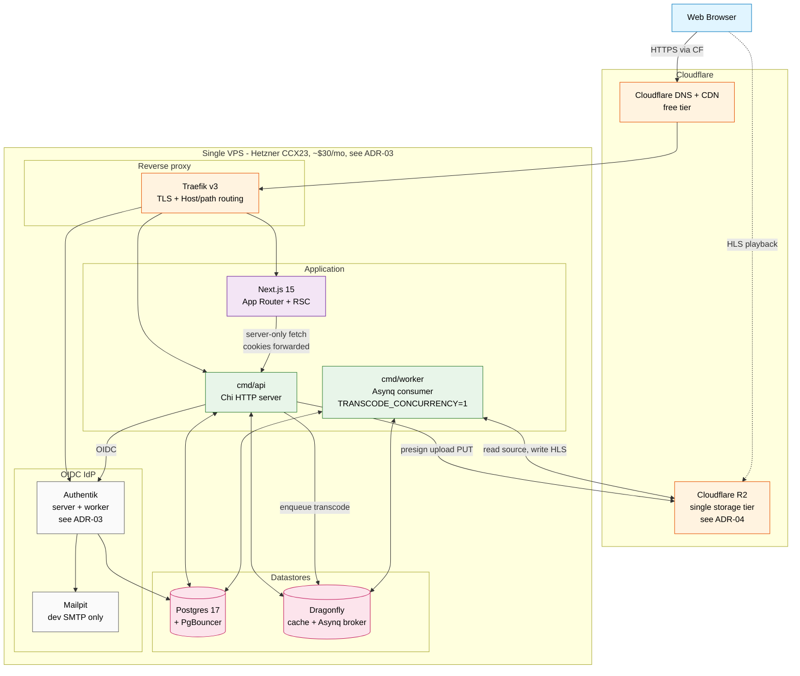

# v1 system landscape

The sparse version of `diagrams.md` §1, scoped to what actually runs in the [v1 cut](../01-v1-scope-cut.md). Everything greyed-out in the long-horizon diagram (LiveKit, mediamtx, MinIO, observability stack) is omitted here so the picture matches what the deploy script actually starts.



## What's missing on purpose

| Greyed-out in this diagram | Why deferred | Reintroduce in |
| --- | --- | --- |
| MinIO origin | R2-only for v1, see [ADR-04](../04-storage-tier-budget.md) | Phase X when first sovereignty-sensitive operator appears |
| Observability stack (Loki/Prometheus/Tempo/Grafana/GlitchTip) | RAM + RAM + RAM; demo uses container logs | Phase 0.5 — recommended before any external user |
| mediamtx (live ingest) | Live streaming is feature.md §9.25 / Phase 10 | Phase 10 |
| LiveKit + coturn (calls) | Voice/video is feature.md §9.37 / Phase 12 | Phase 12 |
| `cmd/sysjobs` (cross-tenant batch) | No multi-tenant data in v1; nothing to batch over | Phase 1 (tenancy) |
| Web Push (VAPID) | Notification module is Phase 6 | Phase 6 |
| Stripe Connect (payouts) | Creator economy is Phase 11 | Phase 11 |

## v1 happy-path flows

The two flows v1 must demonstrate:

### Flow A — OIDC sign-in

```
Browser → Traefik → Next.js sign-in button
       → /api/v1/auth/login → 302 Authentik
       → Authentik prompt → 302 /api/v1/auth/callback
       → API upserts user, issues access+refresh cookies → 302 /
       → Browser lands authenticated
```

### Flow B — Upload → transcode → playback

```
Browser → POST /api/v1/uploads (multipart-or-presign-request)
       → API signs R2 PUT URL, inserts assets row (status=pending), enqueues transcode task
       → Browser PUTs bytes directly to R2 (bypasses VPS for data plane)
       → Asynq delivers transcode task to cmd/worker
       → Worker downloads source from R2, runs FFmpeg HLS ladder, uploads segments to R2
       → Worker UPDATEs assets row (status=ready, hls_master_url, ...)
       → Browser polls assets row OR receives via SSE (post-v1) and starts Vidstack playback from R2
```

Both flows must work end-to-end at the close of the 2-week sprint. See [ADR-05](../05-phase0-wiring-order.md) for the milestone schedule that gets there.
