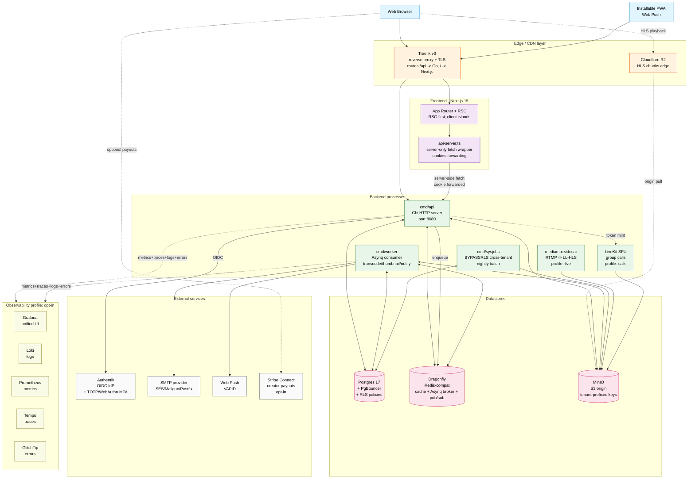
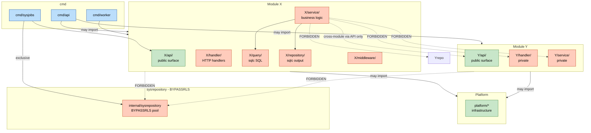
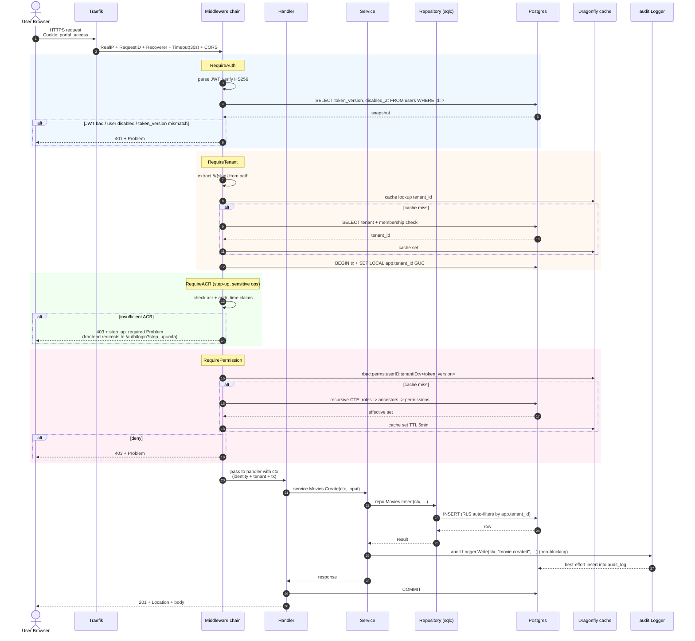
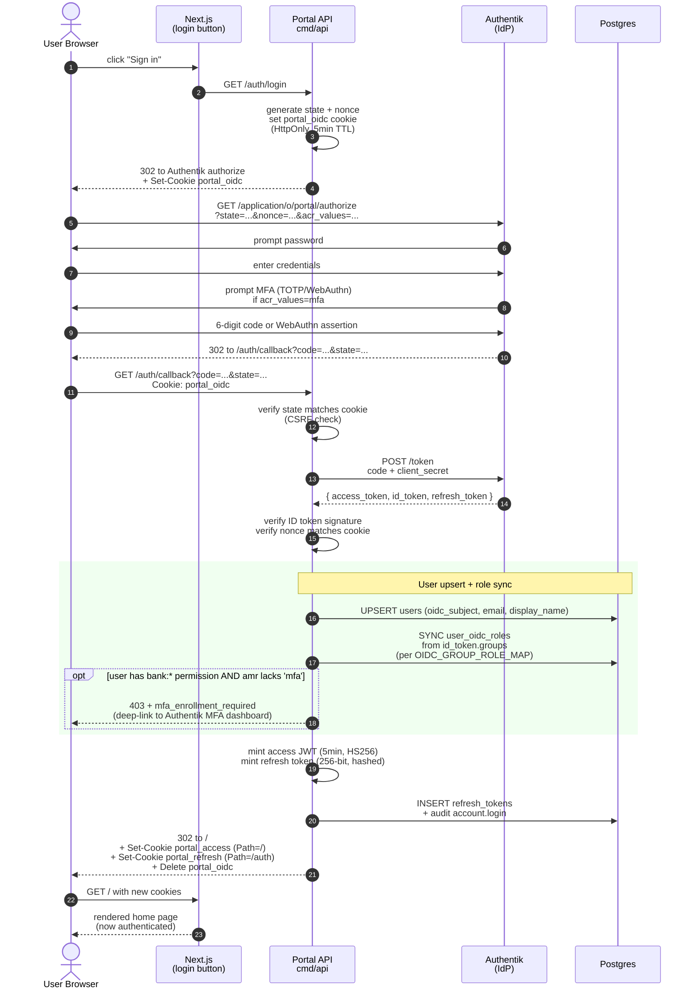
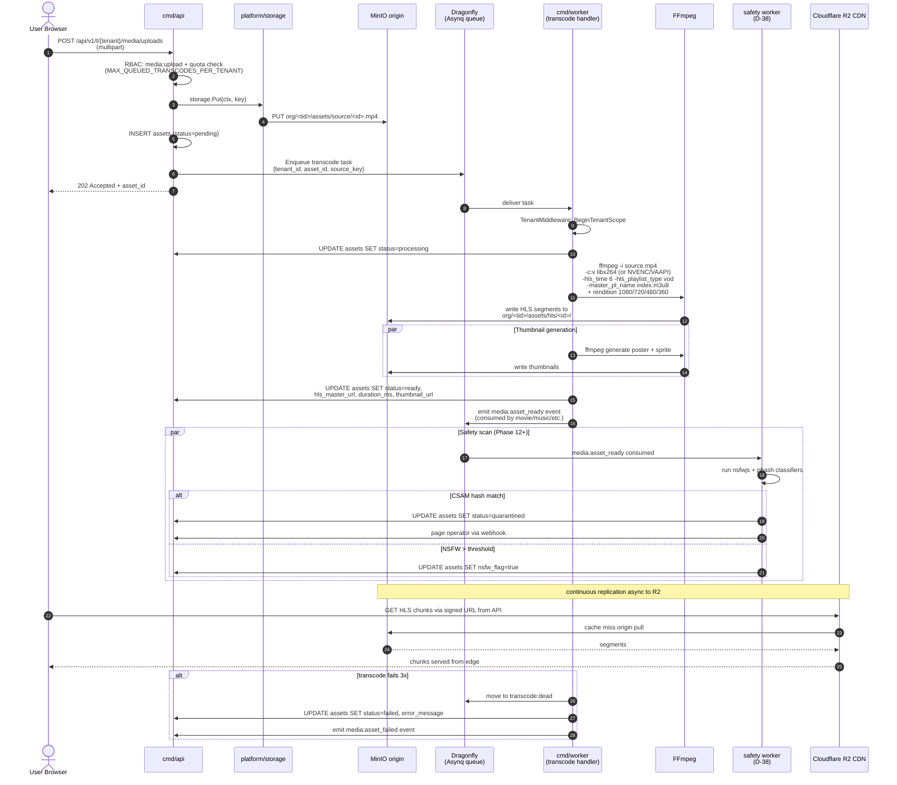

# Portal — System Diagrams

Visual architecture map. Diagrams use Mermaid — renders natively in GitHub, GitLab, VS Code preview, and `mermaid.live`. Source is text, so it's diffable and version-controlled (unlike Miro/Figma exports).

Five views, each answering a different question:

1. **System landscape** — what services run and how data flows between them.
2. **Backend module map** — the modular monolith split.
3. **Module boundary rules** — what's allowed to import what.
4. **Authenticated request flow** — middleware chain on every protected endpoint.
5. **OIDC login sequence** — the auth handshake with Authentik.
6. **Asset upload + transcode flow** — media pipeline end-to-end.
7. **Roadmap phases** — implementation order.

---

## 1. System landscape

The "Miro view" — every component and every connection at one glance.

**Key flows shown:**

- **User playback path** — browser pulls HLS chunks directly from Cloudflare R2 (origin-pull from MinIO on cache miss). Avoids round-tripping through the API.
- **API path** — every authenticated request goes Browser → Traefik → API.
- **RSC fetches** — Next.js server components call API via `api-server.ts` with cookies forwarded, never expose tokens to the browser JS.
- **Workers** — independent process; consume Asynq queue, hit Postgres + MinIO; emit notifications via SMTP + Web Push.
- **Optional services** — LiveKit (calls), mediamtx (live streaming), observability stack are all behind `--profile` flags in docker-compose; self-host single-VM can skip them.

---

## 2. Backend module map

The modular monolith. One Go binary family, but the source tree is split into bounded contexts.

```mermaid
graph TB
    classDef domain fill:#e3f2fd,stroke:#1565c0,color:#000
    classDef bridge fill:#fff8e1,stroke:#f57f17,color:#000
    classDef cross fill:#fce4ec,stroke:#ad1457,color:#000
    classDef plat fill:#e8eaf6,stroke:#283593,color:#000
    classDef cmd fill:#e0f2f1,stroke:#00695c,color:#000

    subgraph CMD[cmd - wiring layer]
        api[api<br/>HTTP server]:::cmd
        worker[worker<br/>Asynq consumer]:::cmd
        sysjobs[sysjobs<br/>BYPASSRLS]:::cmd
    end

    subgraph DOMAIN[Domain modules - internal/modules/]
        account[account<br/>auth + RBAC<br/>OIDC + JWT]:::domain
        tenant[tenant<br/>orgs + memberships<br/>kind: org/household]:::domain
        media[media<br/>assets + transcode<br/>thumbnail workers]:::domain
        movie[movie<br/>catalog + episodes]:::domain
        music[music<br/>tracks + playlists]:::domain
        story[story<br/>chapters + drafts]:::domain
        comic[comic<br/>pages + readers]:::domain
        bank[bank<br/>double-entry ledger<br/>+ investments]:::domain
        notification[notification<br/>in-app + email + push]:::domain
        social[social<br/>posts + follows<br/>+ communities]:::domain
        creator[creator BRIDGE<br/>tips + subs]:::bridge
        marketplace[marketplace BRIDGE<br/>listings + escrow]:::bridge
        safety[safety<br/>NSFW + CSAM]:::cross
    end

    subgraph PLATFORM[Platform - internal/platform/]
        config[config<br/>env loader]:::plat
        db[db<br/>pgx + BeginTenantScope]:::plat
        cache[cache<br/>Redis + TenantKey]:::plat
        storage[storage<br/>S3 + tenant prefix]:::plat
        jobs[jobs<br/>Asynq client]:::plat
        realtime[realtime<br/>SSE + WebSocket<br/>Dragonfly pub/sub]:::plat
        mail[mail<br/>SMTP wrapper]:::plat
        audit[audit<br/>cross-cutting log]:::plat
        observability[observability<br/>OTel + Sentry]:::plat
        mw[middleware<br/>request-id + ratelimit<br/>+ tenant resolver]:::plat
    end

    api -->|MountHTTP| DOMAIN
    worker -->|RegisterTasks| DOMAIN
    sysjobs --> bank
    sysjobs --> tenant

    movie --> media
    music --> media
    story --> media
    comic --> media

    creator --> social
    creator --> bank

    marketplace --> social
    marketplace --> bank

    safety --> media
    safety --> social

    notification -.consumes notify:*.-> DOMAIN

    DOMAIN --> PLATFORM
    api --> mw
    worker --> jobs
```

**Reading guide:**

- **Domain modules** (blue) — bounded contexts. Talk to each other only via their `api/` subpackage.
- **Bridge modules** (yellow) — `creator` and `marketplace` deliberately span social + bank.
- **Cross-cutting** (pink) — `safety` consumes events from `media` + `social` to run NSFW/CSAM/toxicity classifiers.
- **Platform** (indigo) — no business logic; cross-cutting infrastructure.
- **cmd/** (teal) — wiring only; constructs each module once and calls `MountHTTP` / `RegisterTasks`.

Cross-module communication: synchronous via `<module>api.X(ctx, ...)` calls, asynchronous via Asynq events with `<emitting-module>:<event>` naming.

---

## 3. Module boundary rules

What's allowed to import what — enforced by `golangci-lint depguard`.

**Hard rules** (enforced by depguard, fails CI):

| Caller | May import | Must NOT import |
|---|---|---|
| `cmd/api`, `cmd/worker` | every module, `platform/*` | `internal/sysrepository` |
| `cmd/sysjobs` | `internal/sysrepository` (only place!), module `api/` packages | — |
| `modules/X/service` | own module's internals + `platform/*` + other modules' `api/` only | other modules' `service/`, `handler/`, `repository/`, `query/`, subdomain packages |
| Any module | own internals + `platform/*` + other `api/` | `internal/sysrepository` |

The single load-bearing rule: **modules talk to each other only through their `api/` package. They never JOIN across each other's tables.**

---

## 4. Authenticated request flow

The middleware chain on every protected endpoint, with one error path branch shown.

Every protected route walks all five middleware layers in order. RLS at the database is the **last line of defence**: even if a handler forgets a `WHERE tenant_id = ...` clause, Postgres refuses to return the row.

---

## 5. OIDC login sequence

The full auth handshake from "user clicks Sign In" to "session cookies set".

Two cookies are set with distinct paths so the refresh token only ever travels to `/auth/*` endpoints. Refresh-token rotation + reuse detection live in subsequent `/auth/refresh` calls.

---

## 6. Asset upload + transcode flow

End-to-end media pipeline showing how an uploaded video becomes HLS playback.

The whole flow is **non-blocking from the user's perspective**: upload returns immediately with 202, transcode runs in background. Failures route to a dead-letter queue requiring operator action.

---

## 7. Roadmap phases

Implementation order with gating dependencies.

```mermaid
graph LR
    classDef done fill:#c8e6c9,stroke:#2e7d32,color:#000
    classDef next fill:#bbdefb,stroke:#0d47a1,color:#000
    classDef later fill:#e0e0e0,stroke:#616161,color:#000

    P0[Phase 0<br/>Foundation wiring]:::next
    P1[Phase 1<br/>Tenancy + RLS]:::later
    P2[Phase 2<br/>Media pipeline]:::later
    P3[Phase 3<br/>Movies vertical]:::later
    P4[Phase 4<br/>Music/Stories/Comics<br/>+ progress + ratings]:::later
    P5pre[Phase 5 prereq<br/>step-up auth + MFA]:::later
    P5[Phase 5<br/>Bank 5a..5i<br/>ledger/debts/investments]:::later
    P6[Phase 6<br/>Notifications<br/>SSE + email + Web Push]:::later
    P7[Phase 7<br/>Social baseline<br/>newsfeed + follow + DM]:::later
    P8[Phase 8<br/>Search<br/>Postgres FTS]:::later
    P9[Phase 9<br/>Marketing microsite<br/>+ blog + badges]:::later
    P10[Phase 10<br/>Social advanced<br/>stories + reels + live]:::later
    P11[Phase 11<br/>Creator economy<br/>tips + subs + payouts]:::later
    P12[Phase 12<br/>Marketplace + ML safety<br/>+ voice/video calls]:::later

    P0 --> P1
    P1 --> P2
    P2 --> P3
    P3 --> P4
    P0 -.prereq.-> P5pre
    P5pre --> P5
    P4 --> P6
    P5 --> P6
    P6 --> P7
    P7 --> P8
    P7 --> P10
    P9 -.parallel.-> P0
    P10 --> P11
    P5 --> P11
    P11 --> P12
    P10 --> P12
```

**Gate rules:**

- Phase N's exit criterion must be met before Phase N+1 opens.
- Phase 5 (bank) is gated by an explicit prereq sub-phase that lands step-up auth + MFA enforcement first — money operations can't ship without these.
- Phase 9 (microsite) is independent enough to ship in parallel with any other phase once Phase 0 is done.
- Phases 10–12 build on the social + creator + bank trio.

---

## Diagram source

All diagrams are Mermaid 10+ syntax. To preview:

- **GitHub**: renders natively when viewing this file.
- **VS Code**: install "Markdown Preview Mermaid Support" extension.
- **Live edit**: paste any code-block into [mermaid.live](https://mermaid.live).
- **Export PNG/SVG**: use the Mermaid CLI (`@mermaid-js/mermaid-cli`) or `mermaid.live`'s download buttons.

Updates: edit in place. Diagrams are part of the same git diff as code changes — if a module is added or a flow changes, update the corresponding diagram in the same PR.
