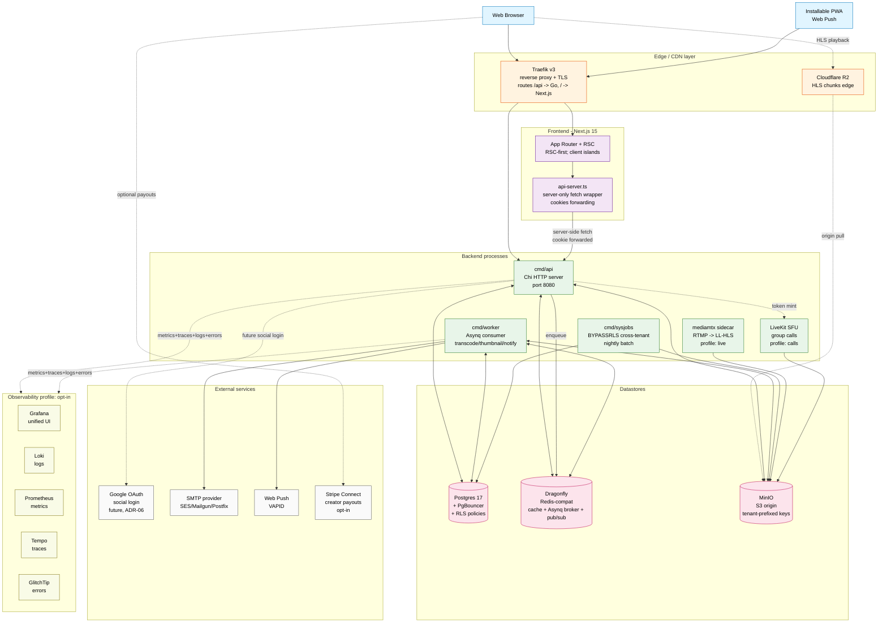
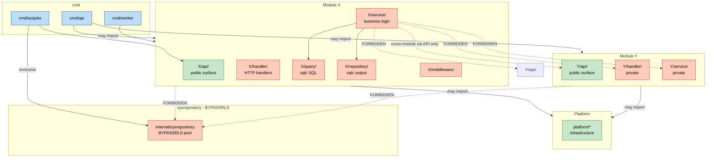
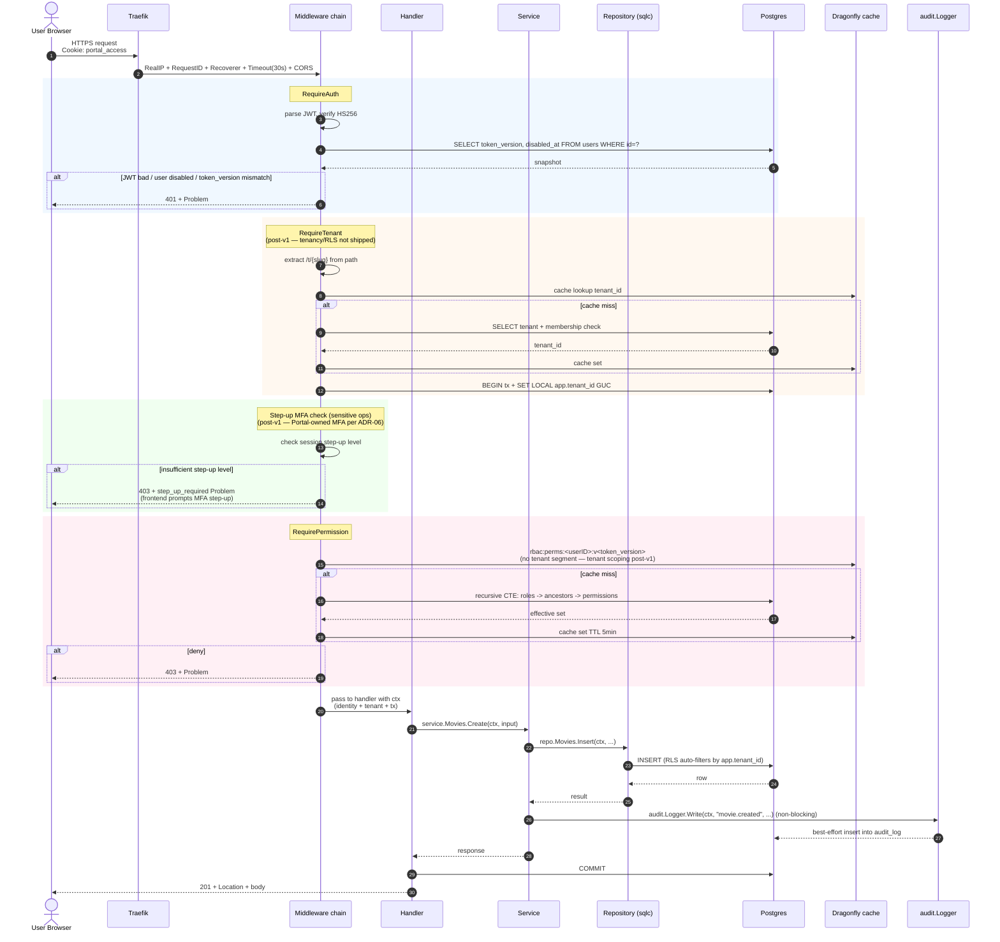
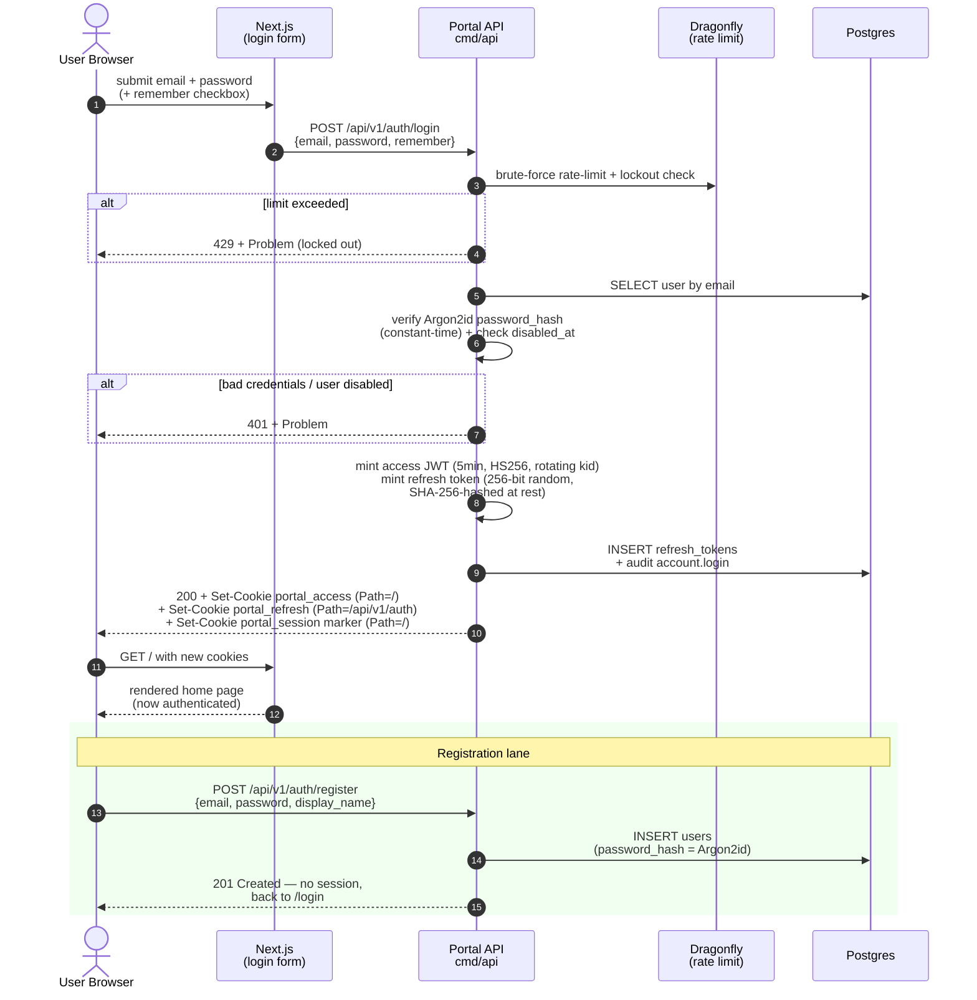

# Portal — System Diagrams

> **Status (2026-07-06):** These diagrams mix the shipped v1 system with the multi-year target. v1 (shipped) = local password auth (ADR-06 — Authentik/OIDC removed entirely), single-tenant media upload → HLS playback slice, 8 compose services (postgres, pgbouncer, dragonfly, minio+minio-setup, traefik, api, worker, frontend), CI. Parts tagged **[TARGET]** show the long-horizon design; see `MILESTONE_CHECKS.md` for live status and [doc/en/architecture/](architecture/) for the v1 scope cut.

Visual architecture map. Diagrams use Mermaid — renders natively in GitHub, GitLab, VS Code preview, and `mermaid.live`. Source is text, so it's diffable and version-controlled (unlike Miro/Figma exports).

Seven views, each answering a different question:

1. **System landscape** — what services run and how data flows between them.
2. **Backend module map** — the modular monolith split.
3. **Module boundary rules** — what's allowed to import what.
4. **Authenticated request flow** — middleware chain on every protected endpoint.
5. **Local password login sequence** — the `/auth/login` flow (ADR-06).
6. **Asset upload + transcode flow** — media pipeline end-to-end.
7. **Roadmap phases** — implementation order.

---

## 1. System landscape

The "Miro view" — every component and every connection at one glance.

```mermaid
graph TB
    classDef user fill:#e1f5ff,stroke:#0277bd,color:#000
    classDef edge fill:#fff3e0,stroke:#e65100,color:#000
    classDef frontend fill:#f3e5f5,stroke:#6a1b9a,color:#000
    classDef backend fill:#e8f5e9,stroke:#2e7d32,color:#000
    classDef datastore fill:#fce4ec,stroke:#c2185b,color:#000
    classDef external fill:#fafafa,stroke:#616161,color:#000
    classDef observability fill:#f9fbe7,stroke:#827717,color:#000

    Browser[Web Browser]:::user
    PWA[Installable PWA<br/>Web Push]:::user

    subgraph EDGE[Edge / CDN layer]
        direction TB
        R2[Cloudflare R2<br/>HLS chunks edge]:::edge
        Traefik[Traefik v3<br/>reverse proxy + TLS<br/>routes /api -> Go, / -> Next.js]:::edge
    end

    subgraph FRONTEND[Frontend - Next.js 15]
        direction TB
        Next[App Router + RSC<br/>RSC-first; client islands]:::frontend
        APIServer[api-server.ts<br/>server-only fetch wrapper<br/>cookies forwarding]:::frontend
    end

    subgraph BACKENDPROC[Backend processes]
        direction TB
        CmdAPI[cmd/api<br/>Chi HTTP server<br/>port 8080]:::backend
        CmdWorker[cmd/worker<br/>Asynq consumer<br/>transcode/thumbnail/notify]:::backend
        CmdSysJobs[cmd/sysjobs<br/>BYPASSRLS cross-tenant<br/>nightly batch]:::backend
        MediaMTX[mediamtx sidecar<br/>RTMP -> LL-HLS<br/>profile: live]:::backend
        LiveKit[LiveKit SFU<br/>group calls<br/>profile: calls]:::backend
    end

    subgraph DATASTORES[Datastores]
        direction LR
        PG[(Postgres 17<br/>+ PgBouncer<br/>+ RLS policies)]:::datastore
        Dragonfly[(Dragonfly<br/>Redis-compat<br/>cache + Asynq broker + pub/sub)]:::datastore
        MinIO[(MinIO<br/>S3 origin<br/>tenant-prefixed keys)]:::datastore
    end

    subgraph EXT[External services]
        direction TB
        GoogleOAuth[Google OAuth<br/>social login<br/>future, ADR-06]:::external
        SMTP[SMTP provider<br/>SES/Mailgun/Postfix]:::external
        WebPush[Web Push<br/>VAPID]:::external
        Stripe[Stripe Connect<br/>creator payouts<br/>opt-in]:::external
    end

    subgraph OBS[Observability profile: opt-in]
        direction LR
        Grafana[Grafana<br/>unified UI]:::observability
        Loki[Loki<br/>logs]:::observability
        Prom[Prometheus<br/>metrics]:::observability
        Tempo[Tempo<br/>traces]:::observability
        GlitchTip[GlitchTip<br/>errors]:::observability
    end

    Browser --> Traefik
    PWA --> Traefik
    Browser -.HLS playback.-> R2
    R2 -.origin pull.-> MinIO

    Traefik --> Next
    Traefik --> CmdAPI
    Next --> APIServer
    APIServer -->|server-side fetch<br/>cookie forwarded| CmdAPI

    CmdAPI <--> PG
    CmdAPI <--> Dragonfly
    CmdAPI <--> MinIO
    CmdAPI -->|enqueue| Dragonfly
    CmdAPI -.future social login.-> GoogleOAuth

    CmdWorker <--> Dragonfly
    CmdWorker <--> PG
    CmdWorker <--> MinIO
    CmdWorker --> SMTP
    CmdWorker --> WebPush

    CmdSysJobs --> PG
    CmdSysJobs --> MinIO

    MediaMTX --> MinIO
    LiveKit --> MinIO
    CmdAPI -.token mint.-> LiveKit

    CmdAPI -.metrics+traces+logs+errors.-> OBS
    CmdWorker -.metrics+traces+logs+errors.-> OBS

    Browser -.optional payouts.-> Stripe
```

**[TARGET] landscape.** v1 running today: the 8 compose services only (postgres, pgbouncer, dragonfly, minio+minio-setup, traefik, api, worker, frontend). Storage is single-tier — MinIO (dev, bind-mounted `./data/minio`) / R2 (prod) per ADR-04; MinIO→R2 origin-pull is long-horizon, and v1 HLS playback is proxied through the API (`GET /api/v1/assets/{id}/hls/*`). sysjobs, mediamtx, LiveKit, the observability stack, Stripe, SMTP, and Web Push are unbuilt. Authentik was removed entirely (ADR-06); auth is Portal-owned local password, MFA becomes Portal-owned later.

**Key flows shown:**

- **User playback path [TARGET]** — browser pulls HLS chunks directly from Cloudflare R2 (origin-pull from MinIO on cache miss). Avoids round-tripping through the API. *(v1: playback goes through the API HLS proxy.)*
- **API path** — every authenticated request goes Browser → Traefik → API.
- **RSC fetches** — Next.js server components call API via `api-server.ts` with cookies forwarded, never expose tokens to the browser JS.
- **Workers** — independent process; consume Asynq queue, hit Postgres + MinIO; emit notifications via SMTP + Web Push.
- **Optional services** — LiveKit (calls), mediamtx (live streaming), observability stack are all behind `--profile` flags in docker-compose; self-host single-VM can skip them.

---

## 2. Backend module map

The modular monolith. One Go binary family, but the source tree is split into bounded contexts.

```mermaid
graph TB
    classDef domain fill:#e3f2fd,stroke:#1565c0,color:#000
    classDef bridge fill:#fff8e1,stroke:#f57f17,color:#000
    classDef cross fill:#fce4ec,stroke:#ad1457,color:#000
    classDef plat fill:#e8eaf6,stroke:#283593,color:#000
    classDef cmd fill:#e0f2f1,stroke:#00695c,color:#000

    subgraph CMD[cmd - wiring layer]
        api[api<br/>HTTP server]:::cmd
        worker[worker<br/>Asynq consumer]:::cmd
        sysjobs[sysjobs<br/>BYPASSRLS]:::cmd
    end

    subgraph DOMAIN[Domain modules - internal/modules/]
        account[account<br/>auth + RBAC<br/>local password Argon2id + JWT]:::domain
        tenant[tenant<br/>orgs + memberships<br/>kind: org/household]:::domain
        media[media<br/>assets + transcode<br/>thumbnail workers]:::domain
        movie[movie<br/>catalog + episodes]:::domain
        music[music<br/>tracks + playlists]:::domain
        story[story<br/>chapters + drafts]:::domain
        comic[comic<br/>pages + readers]:::domain
        bank[bank<br/>double-entry ledger<br/>+ investments]:::domain
        notification[notification<br/>in-app + email + push]:::domain
        social[social<br/>posts + follows<br/>+ communities]:::domain
        creator[creator BRIDGE<br/>tips + subs]:::bridge
        marketplace[marketplace BRIDGE<br/>listings + escrow]:::bridge
        safety[safety<br/>NSFW + CSAM]:::cross
    end

    subgraph PLATFORM[Platform - internal/platform/]
        config[config<br/>env loader]:::plat
        db[db<br/>pgx + BeginTenantScope]:::plat
        cache[cache<br/>Redis + TenantKey]:::plat
        storage[storage<br/>S3 + tenant prefix]:::plat
        jobs[jobs<br/>Asynq client]:::plat
        realtime[realtime<br/>SSE + WebSocket<br/>Dragonfly pub/sub]:::plat
        mail[mail<br/>SMTP wrapper]:::plat
        audit[audit<br/>cross-cutting log]:::plat
        observability[observability<br/>OTel + Sentry]:::plat
        mw[middleware<br/>request-id + ratelimit<br/>+ tenant resolver]:::plat
    end

    api -->|MountHTTP| DOMAIN
    worker -->|RegisterTasks| DOMAIN
    sysjobs --> bank
    sysjobs --> tenant

    movie --> media
    music --> media
    story --> media
    comic --> media

    creator --> social
    creator --> bank

    marketplace --> social
    marketplace --> bank

    safety --> media
    safety --> social

    notification -.consumes notify:*.-> DOMAIN

    DOMAIN --> PLATFORM
    api --> mw
    worker --> jobs
```

**Reading guide:**

- **Build status (2026-07-06):** **built + wired** — `account`, `media`; **scaffold only** — `tenant`, `movie`, `music`, `story`, `comic` (empty `repository/`, not constructed in `main.go`); **planned, no code** — `bank`, `notification`, `social`, `creator`, `marketplace`, `safety`.
- **Domain modules** (blue) — bounded contexts. Talk to each other only via their `api/` subpackage.
- **Bridge modules** (yellow) — `creator` and `marketplace` deliberately span social + bank.
- **Cross-cutting** (pink) — `safety` consumes events from `media` + `social` to run NSFW/CSAM/toxicity classifiers.
- **Platform** (indigo) — no business logic; cross-cutting infrastructure.
- **cmd/** (teal) — wiring only; constructs each module once and calls `MountHTTP` / `RegisterTasks`.

Cross-module communication: synchronous via `<module>api.X(ctx, ...)` calls, asynchronous via Asynq events with `<emitting-module>:<event>` naming.

---

## 3. Module boundary rules

What's allowed to import what — convention per [backend/MODULES.md](../../backend/MODULES.md) (authoritative); `golangci-lint depguard` enforcement is planned — no `.golangci.yml` exists yet, and CI runs `go build`/`vet`/`test` + sqlc-drift, not golangci-lint.

```mermaid
graph TB
    classDef allowed fill:#c8e6c9,stroke:#2e7d32,color:#000
    classDef restricted fill:#ffccbc,stroke:#bf360c,color:#000
    classDef wiring fill:#bbdefb,stroke:#0d47a1,color:#000

    subgraph CMDLAYER[cmd]
        cmdapi[cmd/api]:::wiring
        cmdworker[cmd/worker]:::wiring
        cmdsysjobs[cmd/sysjobs]:::wiring
    end

    subgraph MODX[Module X]
        Xapi[X/api/<br/>public surface]:::allowed
        Xhandler[X/handler/<br/>HTTP handlers]:::restricted
        Xservice[X/service/<br/>business logic]:::restricted
        Xquery[X/query/<br/>sqlc SQL]:::restricted
        Xrepo[X/repository/<br/>sqlc output]:::restricted
        Xmiddleware[X/middleware/]:::restricted
    end

    subgraph MODY[Module Y]
        Yapi[Y/api/<br/>public surface]:::allowed
        Yhandler[Y/handler/<br/>private]:::restricted
        Yservice[Y/service/<br/>private]:::restricted
    end

    subgraph PLAT[Platform]
        platall[platform/*<br/>infrastructure]:::allowed
    end

    subgraph SYSREPO[sysrepository - BYPASSRLS]
        sysrepo[internal/sysrepository<br/>BYPASSRLS pool]:::restricted
    end

    cmdapi -->|may import| MODX
    cmdapi -->|may import| MODY
    cmdworker --> MODX
    cmdsysjobs -->|exclusive| sysrepo
    cmdsysjobs --> Xapi

    MODX -->|may import| PLAT
    MODY -->|may import| PLAT
    Xservice -.cross-module via API only.-> Yapi

    Xservice -.FORBIDDEN.-> Yservice
    Xservice -.FORBIDDEN.-> Yrepo
    Xservice -.FORBIDDEN.-> Yhandler

    MODX -.FORBIDDEN.-> sysrepo
    MODY -.FORBIDDEN.-> sysrepo

    Xservice --> Xquery
    Xservice --> Xrepo
```

**Hard rules** (convention today; depguard-in-CI planned):

| Caller | May import | Must NOT import |
|---|---|---|
| `cmd/api`, `cmd/worker` | every module, `platform/*` | `internal/sysrepository` |
| `cmd/sysjobs` | `internal/sysrepository` (only place!), module `api/` packages | — |
| `modules/X/service` | own module's internals + `platform/*` + other modules' `api/` only | other modules' `service/`, `handler/`, `repository/`, `query/`, subdomain packages |
| Any module | own internals + `platform/*` + other `api/` | `internal/sysrepository` |

The single load-bearing rule: **modules talk to each other only through their `api/` package. They never JOIN across each other's tables.**

---

## 4. Authenticated request flow

The middleware chain on every protected endpoint, with one error path branch shown.

**v1 chain today:** RealIP → RequestID → Recoverer → Timeout → RequireAuth → RequirePermission. The tenant and step-up layers below are post-v1.

```mermaid
sequenceDiagram
    autonumber
    actor U as User Browser
    participant T as Traefik
    participant Mw as Middleware chain
    participant H as Handler
    participant S as Service
    participant R as Repository (sqlc)
    participant PG as Postgres
    participant Ca as Dragonfly cache
    participant Au as audit.Logger

    U->>T: HTTPS request<br/>Cookie: portal_access
    T->>Mw: RealIP + RequestID + Recoverer + Timeout(30s) + CORS

    rect rgb(240, 248, 255)
        Note over Mw: RequireAuth
        Mw->>Mw: parse JWT, verify HS256
        Mw->>PG: SELECT token_version, disabled_at FROM users WHERE id=?
        PG-->>Mw: snapshot
        alt JWT bad / user disabled / token_version mismatch
            Mw-->>U: 401 + Problem
        end
    end

    rect rgb(255, 248, 240)
        Note over Mw: RequireTenant<br/>(post-v1 — tenancy/RLS not shipped)
        Mw->>Mw: extract /t/{slug} from path
        Mw->>Ca: cache lookup tenant_id
        alt cache miss
            Mw->>PG: SELECT tenant + membership check
            PG-->>Mw: tenant_id
            Mw->>Ca: cache set
        end
        Mw->>PG: BEGIN tx + SET LOCAL app.tenant_id GUC
    end

    rect rgb(240, 255, 240)
        Note over Mw: Step-up MFA check (sensitive ops)<br/>(post-v1 — Portal-owned MFA per ADR-06)
        Mw->>Mw: check session step-up level
        alt insufficient step-up level
            Mw-->>U: 403 + step_up_required Problem<br/>(frontend prompts MFA step-up)
        end
    end

    rect rgb(255, 240, 245)
        Note over Mw: RequirePermission
        Mw->>Ca: rbac:perms:<userID>:v<token_version><br/>(no tenant segment — tenant scoping post-v1)
        alt cache miss
            Mw->>PG: recursive CTE: roles -> ancestors -> permissions
            PG-->>Mw: effective set
            Mw->>Ca: cache set TTL 5min
        end
        alt deny
            Mw-->>U: 403 + Problem
        end
    end

    Mw->>H: pass to handler with ctx<br/>(identity + tenant + tx)
    H->>S: service.Movies.Create(ctx, input)
    S->>R: repo.Movies.Insert(ctx, ...)
    R->>PG: INSERT (RLS auto-filters by app.tenant_id)
    PG-->>R: row
    R-->>S: result
    S->>Au: audit.Logger.Write(ctx, "movie.created", ...) (non-blocking)
    Au-->>PG: best-effort insert into audit_log
    S-->>H: response
    H->>PG: COMMIT
    H-->>U: 201 + Location + body
```

Every protected route walks these layers in order — in v1 that means the auth + permission layers; tenant and step-up are post-v1. Once tenancy ships, RLS at the database is the **last line of defence**: even if a handler forgets a `WHERE tenant_id = ...` clause, Postgres refuses to return the row.

---

## 5. Local password login sequence

The `/auth/login` flow (ADR-06 — Portal owns credentials; Authentik/OIDC removed entirely). From "user submits the login form" to "session cookies set".

```mermaid
sequenceDiagram
    autonumber
    actor U as User Browser
    participant N as Next.js<br/>(login form)
    participant A as Portal API<br/>cmd/api
    participant Rd as Dragonfly<br/>(rate limit)
    participant PG as Postgres

    U->>N: submit email + password<br/>(+ remember checkbox)
    N->>A: POST /api/v1/auth/login<br/>{email, password, remember}

    A->>Rd: brute-force rate-limit + lockout check
    alt limit exceeded
        A-->>U: 429 + Problem (locked out)
    end

    A->>PG: SELECT user by email
    A->>A: verify Argon2id password_hash<br/>(constant-time) + check disabled_at
    alt bad credentials / user disabled
        A-->>U: 401 + Problem
    end

    A->>A: mint access JWT (5min, HS256, rotating kid)<br/>mint refresh token (256-bit random,<br/>SHA-256-hashed at rest)
    A->>PG: INSERT refresh_tokens<br/>+ audit account.login
    A-->>U: 200 + Set-Cookie portal_access (Path=/)<br/>+ Set-Cookie portal_refresh (Path=/api/v1/auth)<br/>+ Set-Cookie portal_session marker (Path=/)

    U->>N: GET / with new cookies
    N-->>U: rendered home page<br/>(now authenticated)

    rect rgb(240, 255, 240)
        Note over U,PG: Registration lane
        U->>A: POST /api/v1/auth/register<br/>{email, password, display_name}
        A->>PG: INSERT users<br/>(password_hash = Argon2id)
        A-->>U: 201 Created — no session,<br/>back to /login
    end
```

Three cookies with distinct paths: `portal_access` (Path=/) and `portal_refresh` (Path=/api/v1/auth) are `HttpOnly Secure`; `portal_session` (Path=/) is a marker read by the Next.js middleware auth gate. The path split means the refresh token only ever travels to `/api/v1/auth/*` endpoints. `remember=true` → persistent 24h cookies (`REFRESH_TOKEN_TTL=24h`), else session cookies. Refresh-token rotation + reuse detection (chain revocation + `auth.refresh.reuse_detected` audit event) live in subsequent `POST /auth/refresh` calls.

---

## 6. Asset upload + transcode flow

End-to-end media pipeline showing how an uploaded video becomes HLS playback.

```mermaid
sequenceDiagram
    autonumber
    actor U as User Browser
    participant A as cmd/api
    participant M as Object storage<br/>MinIO (dev) / R2 (prod)
    participant Q as Dragonfly<br/>(Asynq queue)
    participant W as cmd/worker<br/>(transcode handler)
    participant F as FFmpeg
    participant Sa as safety worker<br/>(D-38, planned)
    participant R as Cloudflare R2 CDN<br/>[TARGET] edge tier

    U->>A: POST /api/v1/assets<br/>{filename, content_type}
    A->>A: RBAC: media:upload<br/>(per-tenant quota: post-v1)
    A->>A: INSERT assets (status=pending)
    A-->>U: 201 + asset_id<br/>+ presigned PUT URL

    alt presigned upload
        U->>M: PUT source object<br/>(presigned URL)
    else API-proxied upload (dev)
        U->>A: PUT /api/v1/assets/{id}/source
        A->>M: PUT source object
    end

    U->>A: POST /api/v1/assets/{id}/complete
    A->>Q: Enqueue transcode task {asset_id}
    A-->>U: 202 Accepted

    Q->>W: deliver task
    W->>A: UPDATE assets SET status=processing
    W->>M: download source
    W->>F: ffprobe source
    W->>F: ffmpeg VOD HLS<br/>h264/aac, single rendition<br/>[TARGET: 1080/720/480/360 ladder,<br/>NVENC/VAAPI]
    F-->>W: manifest + segments
    W->>M: upload assets/hls/{id}/*

    par Thumbnail generation (stub in v1 — no output yet)
        W->>F: ffmpeg generate poster + sprite
        F->>M: write thumbnails
    end

    W->>A: MarkAssetReady: UPDATE assets<br/>SET status=ready, hls_master_url, duration_ms
    W-->>Q: emit media:asset_ready event<br/>(planned — not emitted in v1, no consumer;<br/>worker sets status=ready directly)

    par Safety scan (Phase 12+, planned)
        Q->>Sa: media:asset_ready consumed
        Sa->>Sa: run nsfwjs + phash classifiers
        alt CSAM hash match
            Sa->>A: UPDATE assets SET status=quarantined
            Sa->>A: page operator via webhook
        else NSFW > threshold
            Sa->>A: UPDATE assets SET nsfw_flag=true
        end
    end

    Note over U,M: v1 playback — public HLS proxy through the API
    U->>A: GET /api/v1/assets/{id}/hls/*<br/>(Vidstack player)
    A->>M: fetch manifest / segment
    M-->>A: bytes
    A-->>U: HLS served via API

    Note over M,R: [TARGET] continuous async replication to R2<br/>(ADR-04: deployed envs are R2-only single-tier)
    U->>R: [TARGET] GET HLS chunks from edge
    R->>M: cache miss origin pull
    M-->>R: segments
    R-->>U: chunks served from edge

    alt transcode fails 3x (design intent — dead-letter + asset_failed not implemented in v1)
        W->>Q: move to transcode:dead
        W->>A: UPDATE assets SET status=failed, error_message
        W->>A: emit media:asset_failed event
    end
```

The flow is **non-blocking from the user's perspective**: `/complete` returns 202 and transcode runs in the background; the asset becomes playable when `assets.status=ready` (`GET /api/v1/assets/{id}`), then Vidstack plays via the API HLS proxy. The dead-letter queue for failures is design intent, not yet implemented.

---

## 7. Roadmap phases

Implementation order with gating dependencies.

```mermaid
graph LR
    classDef done fill:#c8e6c9,stroke:#2e7d32,color:#000
    classDef next fill:#bbdefb,stroke:#0d47a1,color:#000
    classDef later fill:#e0e0e0,stroke:#616161,color:#000

    P0[Phase 0<br/>Foundation wiring]:::done
    P1[Phase 1<br/>Tenancy + RLS]:::later
    P2[Phase 2<br/>Media pipeline]:::later
    P3[Phase 3<br/>Movies vertical]:::later
    P4[Phase 4<br/>Music/Stories/Comics<br/>+ progress + ratings]:::later
    P5pre[Phase 5 prereq<br/>step-up auth + MFA]:::later
    P5[Phase 5<br/>Bank 5a..5i<br/>ledger/debts/investments]:::later
    P6[Phase 6<br/>Notifications<br/>SSE + email + Web Push]:::later
    P7[Phase 7<br/>Social baseline<br/>newsfeed + follow + DM]:::later
    P8[Phase 8<br/>Search<br/>Postgres FTS]:::later
    P9[Phase 9<br/>Marketing microsite<br/>+ blog + badges]:::later
    P10[Phase 10<br/>Social advanced<br/>stories + reels + live]:::later
    P11[Phase 11<br/>Creator economy<br/>tips + subs + payouts]:::later
    P12[Phase 12<br/>Marketplace + ML safety<br/>+ voice/video calls]:::later

    P0 --> P1
    P1 --> P2
    P2 --> P3
    P3 --> P4
    P0 -.prereq.-> P5pre
    P5pre --> P5
    P4 --> P6
    P5 --> P6
    P6 --> P7
    P7 --> P8
    P7 --> P10
    P9 -.parallel.-> P0
    P10 --> P11
    P5 --> P11
    P11 --> P12
    P10 --> P12
```

> **Update (2026-07-06):** Phase 0 complete (migrations 0001–0007, sqlc, repository adapters, account + media wired in `cmd/api`, healthz green). v1 additionally shipped a single-tenant media upload→HLS happy path — a subset of Phase 2 taken ahead of Phase 1 tenancy per [01-v1-scope-cut.md](architecture/01-v1-scope-cut.md) — plus CI. Phase content is authoritative in [feature.md](feature.md); this diagram tracks dependencies only.

**Gate rules:**

- Phase N's exit criterion must be met before Phase N+1 opens.
- Phase 5 (bank) is gated by an explicit prereq sub-phase that lands step-up auth + MFA enforcement first (Portal-owned MFA per ADR-06 — no external IdP) — money operations can't ship without these.
- Phase 9 (microsite) is independent enough to ship in parallel with any other phase once Phase 0 is done.
- Phases 10–12 build on the social + creator + bank trio.

---

## Diagram source

All diagrams are Mermaid 10+ syntax. To preview:

- **GitHub**: renders natively when viewing this file.
- **VS Code**: install "Markdown Preview Mermaid Support" extension.
- **Live edit**: paste any code-block into [mermaid.live](https://mermaid.live).
- **Export PNG/SVG**: use the Mermaid CLI (`@mermaid-js/mermaid-cli`) or `mermaid.live`'s download buttons.

Updates: edit in place. Diagrams are part of the same git diff as code changes — if a module is added or a flow changes, update the corresponding diagram in the same PR.
