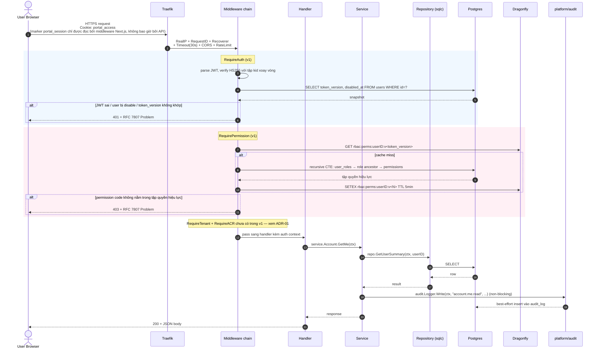

# Luồng request đã xác thực của v1

Phiên bản đơn giản hóa của `diagrams.md` §4, đã áp dụng v1 cut. Sơ đồ dài hạn đầy đủ cho thấy 5 lớp middleware (RequireAuth → RequireTenant → RequireACR → RequirePermission → handler); v1 chỉ ship 2 trong số đó (RequireAuth, RequirePermission). Tenant và step-up auth sẽ đến ở các phase sau.

## Ghi chú

- **Cơ chế thu hồi hai kênh hoạt động mà không cần RequireTenant.** Bump `users.token_version` sẽ invalidate mọi permission set đã cache (key namespace theo `v<N>`) VÀ mọi access token đã phát hành (được re-fetch ở mỗi request). v1 kế thừa cả hai hành vi này.
- **RequireTenant sẽ đến ở Phase 1.** Khi đó, chain của mọi route protected trở thành `RequireAuth → RequireTenant → RequirePermission → handler`. Việc v1 chưa có tenant là chủ đích (xem [ADR-01](../01-v1-scope-cut.md)); handler hiện có chưa cần biết tới tenant context cho tới lúc đó.
- **RequireACR (step-up) đang được để dành.** [D-27] yêu cầu các operation nhạy cảm liên quan bank phải gate bằng một MFA còn mới (fresh). Bank không thuộc v1, nên middleware này chưa được nối dây. Kể từ [ADR-06](../06-local-auth-model.md) (xác thực mật khẩu local) access token không còn mang claim `amr` / `acr` / `auth_time`; chúng sẽ được đưa vào cùng lúc với MFA/step-up, nên RequireACR có thể đến sau mà không cần viết lại middleware chain.
- **Bước audit là best-effort.** Theo CLAUDE.md, `audit.Logger.Write` nuốt lỗi (swallow errors) và không bao giờ block request. Một trục trặc DB ở audit_log không được phép làm request của user trả về 500. Đừng để handler phụ thuộc vào giá trị trả về.
- **RBAC cache TTL là 5 phút.** Kết hợp với namespacing theo `token_version`, độ trễ thu hồi trong trường hợp xấu nhất là `min(remaining JWT TTL, 5 min)` cho permission đã cache, và tức thì cho request mới sau khi bump. Khớp với access-token TTL là 5 phút.

## Những gì thay đổi khi mỗi phase sau lên

| Phase | Thay đổi với sơ đồ này |
| --- | --- |
| Phase 1 (tenancy) | Chèn `RequireTenant` giữa RequireAuth và RequirePermission. Thêm GUC `SET LOCAL app.tenant_id` trên tx của request để RLS filter mọi query phía sau. |
| Phase 5 prereq | Chèn `RequireACR("acr:portal:recent_mfa")` chỉ trên các route nhạy cảm liên quan bank. Trả về 403 + Problem `step_up_required` nếu claim `acr` không đủ; frontend redirect sang prompt MFA. |
| Phase 6 (notifications) | Service layer emit task Asynq `notify:*` sau khi ghi. Không đổi middleware chain. |
| Phase 1.5+ (lớp RBAC) | RequirePermission có thêm một bước resolution: duyệt user_policy_attachments + group_policy_attachments trước khi union với role; áp filter file-gate trước bước deny check. Xem [ADR-02](../02-rbac-model-reconciliation.md). |
