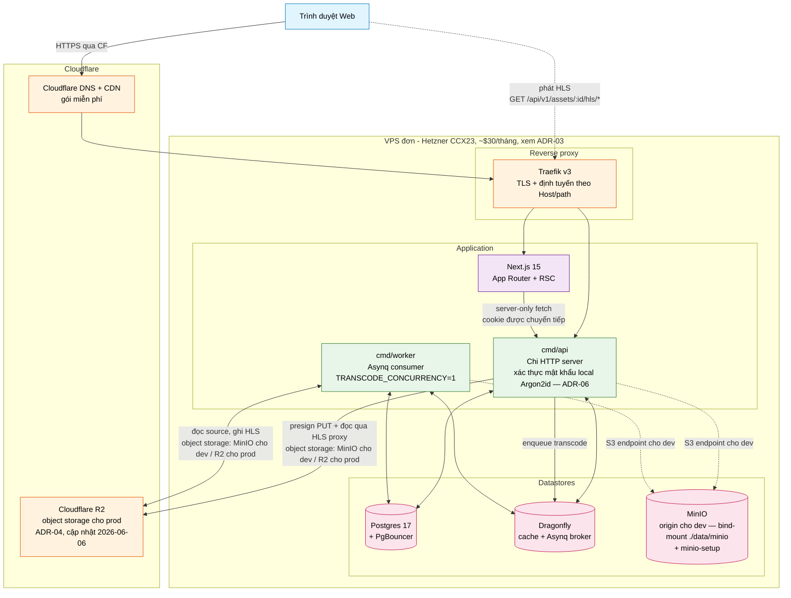

# Landscape hệ thống v1

> **Trạng thái:** phản ánh stack v1 đã ship tính đến **2026-07-06** — 8 compose service (postgres, pgbouncer, dragonfly, minio + minio-setup, traefik, api, worker, frontend). Auth là local-password theo [ADR-06](../06-local-auth-model.md).

Phiên bản rút gọn của `diagrams.md` §1, giới hạn trong phạm vi thực sự chạy ở [v1 cut](../01-v1-scope-cut.md). Mọi thứ bị grey-out trong sơ đồ dài hạn (LiveKit, mediamtx, observability stack) đều bị lược bỏ ở đây để bức tranh khớp với những gì compose stack thực sự khởi động. MinIO xuất hiện vì dev chạy nó như S3 endpoint (prod = R2).



## Những gì cố tình bị lược bỏ

| Bị grey-out trong sơ đồ này | Vì sao bị hoãn | Đưa trở lại ở |
| --- | --- | --- |
| MinIO như một tầng origin cho **prod** | Dev đã chạy MinIO như S3 endpoint; các môi trường triển khai (deployed envs) vẫn chỉ dùng R2 theo bản cập nhật [ADR-04](../04-storage-tier-budget.md) (2026-06-06) | Phase X khi operator đầu tiên nhạy cảm về chủ quyền dữ liệu (sovereignty) xuất hiện |
| Observability stack (Loki/Prometheus/Tempo/Grafana/GlitchTip) | Tốn RAM + RAM + RAM; demo dùng container logs | Phase 0.5 — khuyến nghị trước khi có user bên ngoài đầu tiên |
| mediamtx (live ingest) | Live streaming nằm ở feature.md §9.25 / Phase 10 | Phase 10 |
| LiveKit + coturn (calls) | Voice/video nằm ở feature.md §9.37 / Phase 12 | Phase 12 |
| `cmd/sysjobs` (batch cross-tenant) | Không có dữ liệu multi-tenant trong v1; không có gì để batch | Phase 1 (tenancy) |
| Web Push (VAPID) | Module notification nằm ở Phase 6 | Phase 6 |
| Stripe Connect (payouts) | Creator economy nằm ở Phase 11 | Phase 11 |

## Các flow happy-path của v1

Hai flow mà v1 phải chứng minh được:

### Flow A — Đăng nhập bằng mật khẩu local

```
Browser → Traefik → trang /login của Next.js
       → POST /api/v1/auth/login {email, password, remember}
       → API rate-limit (giới hạn brute-force qua Redis + lockout), xác minh hash Argon2id (constant-time), kiểm tra disabled_at
       → phát hành JWT access (5 phút) + refresh token, set cookie portal_access / portal_refresh / portal_session
       → Browser đã authenticated
```

`POST /auth/register` trả về **201 không kèm session** — user quay lại `/login`. Không còn `/auth/callback`, `state`, hay `nonce` ([ADR-06](../06-local-auth-model.md), 2026-07-05).

### Flow B — Upload → transcode → playback

```
Browser → POST /api/v1/assets
       → API insert row assets (status=pending), trả về presigned PUT URL
       → Browser upload bytes (dev: API-proxied PUT /assets/{id}/source → MinIO; prod: presigned PUT thẳng tới R2)
       → POST /api/v1/assets/{id}/complete → API enqueue tác vụ transcode
       → Asynq giao tác vụ transcode cho cmd/worker
       → Worker download source → ffprobe → ffmpeg VOD HLS (h264/aac) → upload manifest + segment
       → Worker MarkAssetReady (status=ready)
       → Browser poll GET /assets/{id} tới khi status=ready → Vidstack phát qua proxy công khai GET /assets/{id}/hls/*
```

> **Cập nhật (2026-07-06):** cả hai flow đã được implement và commit; [MILESTONE_CHECKS.md](../../../../MILESTONE_CHECKS.md) là status tracker sống. [ADR-05](../05-phase0-wiring-order.md) ghi lại lịch trình milestone dẫn tới đó.
