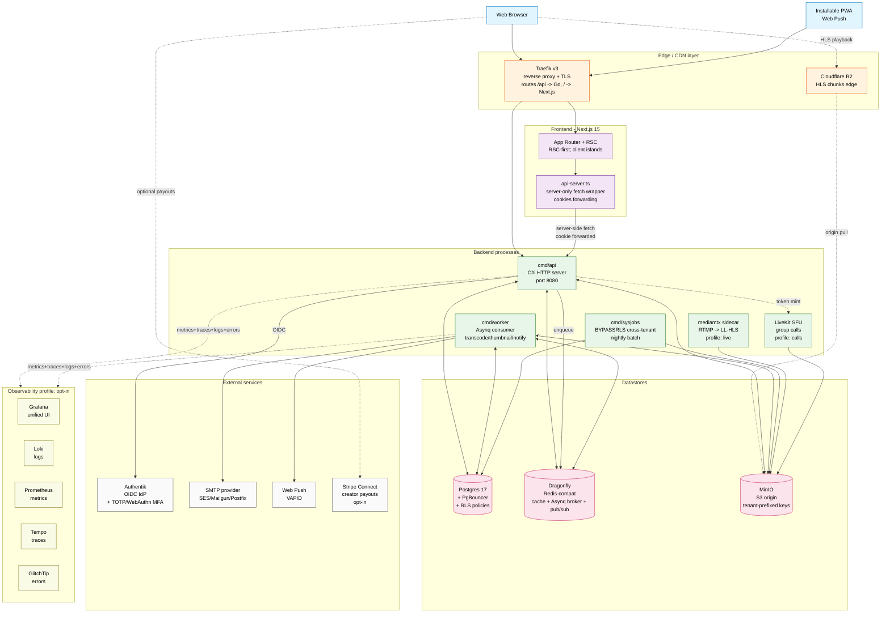
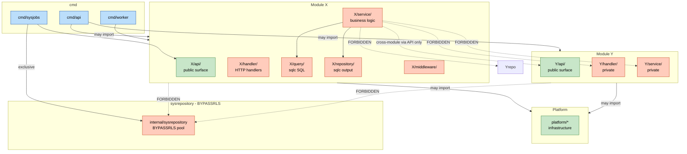
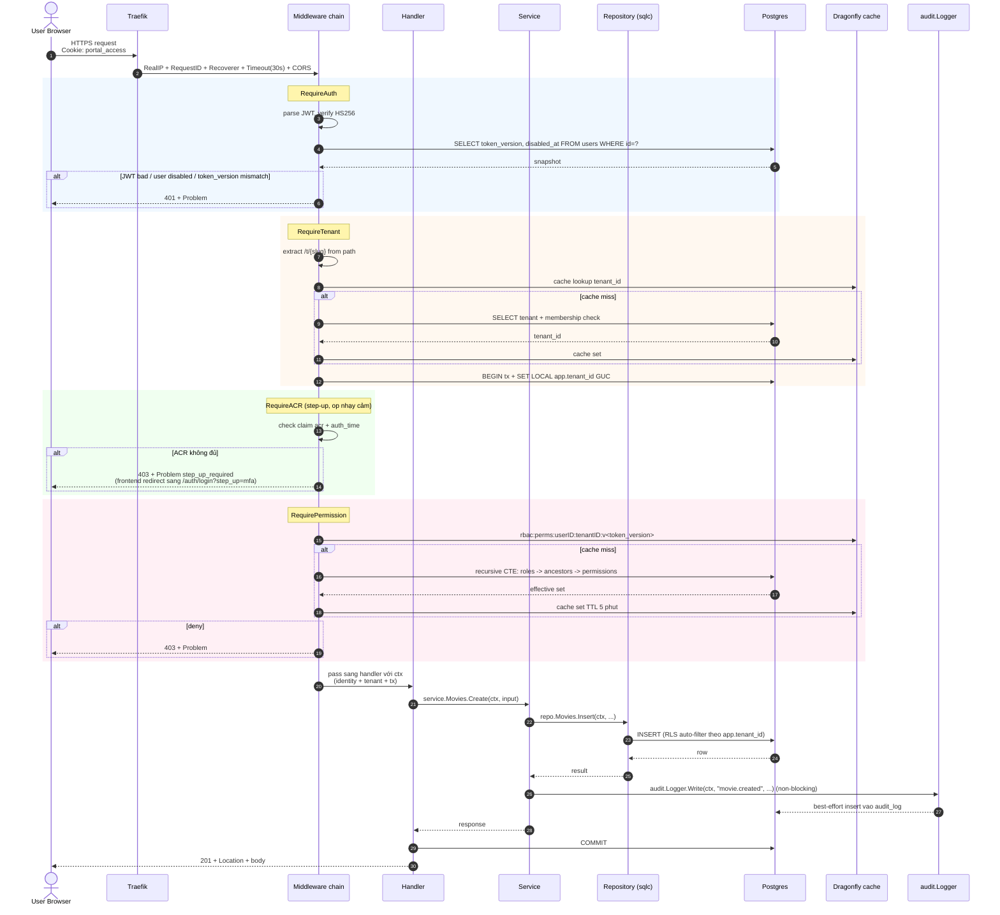
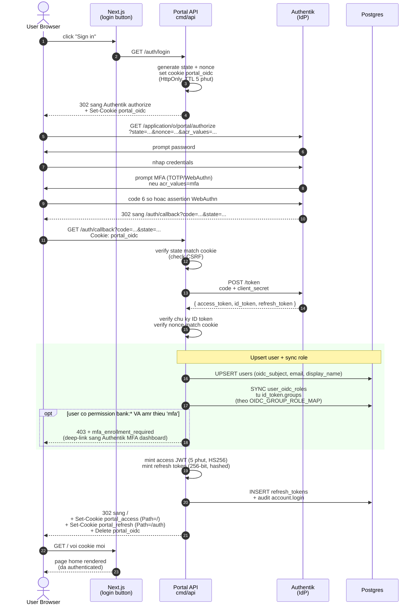
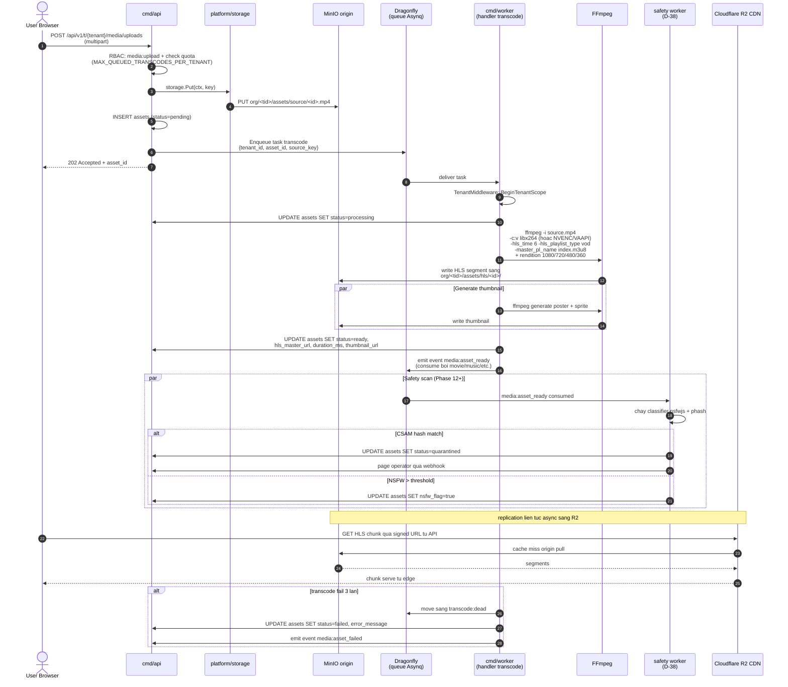

# Portal — Sơ đồ hệ thống

Bản đồ kiến trúc trực quan. Sơ đồ dùng Mermaid — render native trong GitHub, GitLab, VS Code preview, và `mermaid.live`. Source là text, nên diff được và version-controlled (không như export Miro/Figma).

Bảy view, mỗi cái trả lời một câu hỏi khác nhau:

1. **Landscape hệ thống** — service nào chạy và data flow giữa chúng thế nào.
2. **Bản đồ module backend** — phân chia modular monolith.
3. **Quy tắc boundary module** — cái gì được import cái gì.
4. **Flow request đã authenticate** — chain middleware trên mọi endpoint protected.
5. **Sequence OIDC login** — handshake auth với Authentik.
6. **Flow upload + transcode asset** — pipeline media end-to-end.
7. **Phase roadmap** — thứ tự implementation.

Sơ đồ giữ nguyên label tiếng Anh (technical terms). Narrative xung quanh là tiếng Việt.

---

## 1. Landscape hệ thống

View "Miro" — mọi component và mọi connection trong một lượt nhìn.

**Flow chính được show:**

- **Path playback của user** — browser pull HLS chunk trực tiếp từ Cloudflare R2 (origin-pull từ MinIO khi cache miss). Tránh round-trip qua API.
- **Path API** — mọi request đã authenticate đi Browser → Traefik → API.
- **RSC fetch** — server component Next.js gọi API qua `api-server.ts` với cookie forward, không bao giờ expose token cho JS browser.
- **Worker** — process độc lập; consume queue Asynq, hit Postgres + MinIO; emit notification qua SMTP + Web Push.
- **Service optional** — LiveKit (call), mediamtx (live streaming), observability stack đều sau flag `--profile` trong docker-compose; self-host single-VM có thể skip.

---

## 2. Bản đồ module backend

Modular monolith. Một family binary Go duy nhất, nhưng source tree split thành các bounded context.

```mermaid
graph TB
    classDef domain fill:#e3f2fd,stroke:#1565c0,color:#000
    classDef bridge fill:#fff8e1,stroke:#f57f17,color:#000
    classDef cross fill:#fce4ec,stroke:#ad1457,color:#000
    classDef plat fill:#e8eaf6,stroke:#283593,color:#000
    classDef cmd fill:#e0f2f1,stroke:#00695c,color:#000

    subgraph CMD[cmd - wiring layer]
        api[api<br/>HTTP server]:::cmd
        worker[worker<br/>Asynq consumer]:::cmd
        sysjobs[sysjobs<br/>BYPASSRLS]:::cmd
    end

    subgraph DOMAIN[Domain modules - internal/modules/]
        account[account<br/>auth + RBAC<br/>OIDC + JWT]:::domain
        tenant[tenant<br/>orgs + memberships<br/>kind: org/household]:::domain
        media[media<br/>assets + transcode<br/>thumbnail workers]:::domain
        movie[movie<br/>catalog + episodes]:::domain
        music[music<br/>tracks + playlists]:::domain
        story[story<br/>chapters + drafts]:::domain
        comic[comic<br/>pages + readers]:::domain
        bank[bank<br/>double-entry ledger<br/>+ investments]:::domain
        notification[notification<br/>in-app + email + push]:::domain
        social[social<br/>posts + follows<br/>+ communities]:::domain
        creator[creator BRIDGE<br/>tips + subs]:::bridge
        marketplace[marketplace BRIDGE<br/>listings + escrow]:::bridge
        safety[safety<br/>NSFW + CSAM]:::cross
    end

    subgraph PLATFORM[Platform - internal/platform/]
        config[config<br/>env loader]:::plat
        db[db<br/>pgx + BeginTenantScope]:::plat
        cache[cache<br/>Redis + TenantKey]:::plat
        storage[storage<br/>S3 + tenant prefix]:::plat
        jobs[jobs<br/>Asynq client]:::plat
        realtime[realtime<br/>SSE + WebSocket<br/>Dragonfly pub/sub]:::plat
        mail[mail<br/>SMTP wrapper]:::plat
        audit[audit<br/>cross-cutting log]:::plat
        observability[observability<br/>OTel + Sentry]:::plat
        mw[middleware<br/>request-id + ratelimit<br/>+ tenant resolver]:::plat
    end

    api -->|MountHTTP| DOMAIN
    worker -->|RegisterTasks| DOMAIN
    sysjobs --> bank
    sysjobs --> tenant

    movie --> media
    music --> media
    story --> media
    comic --> media

    creator --> social
    creator --> bank

    marketplace --> social
    marketplace --> bank

    safety --> media
    safety --> social

    notification -.consumes notify:*.-> DOMAIN

    DOMAIN --> PLATFORM
    api --> mw
    worker --> jobs
```

**Hướng dẫn đọc:**

- **Domain modules** (xanh dương) — bounded context. Nói chuyện với nhau chỉ qua subpackage `api/`.
- **Bridge modules** (vàng) — `creator` và `marketplace` chủ ý span social + bank.
- **Cross-cutting** (hồng) — `safety` consume event từ `media` + `social` để chạy classifier NSFW/CSAM/toxicity.
- **Platform** (chàm) — không có logic nghiệp vụ; hạ tầng cross-cutting.
- **cmd/** (xanh ngọc) — chỉ wiring; construct mỗi module một lần và gọi `MountHTTP` / `RegisterTasks`.

Giao tiếp cross-module: synchronous qua call `<module>api.X(ctx, ...)`, asynchronous qua event Asynq với naming `<emitting-module>:<event>`.

---

## 3. Quy tắc boundary module

Cái gì được import cái gì — enforce bởi `golangci-lint depguard`.

**Quy tắc cứng** (enforce bởi depguard, fail CI):

| Caller | Được import | KHÔNG được import |
|---|---|---|
| `cmd/api`, `cmd/worker` | mọi module, `platform/*` | `internal/sysrepository` |
| `cmd/sysjobs` | `internal/sysrepository` (chỉ nơi duy nhất!), package `api/` của module | — |
| `modules/X/service` | internal của module mình + `platform/*` + chỉ `api/` của module khác | `service/`, `handler/`, `repository/`, `query/`, package subdomain của module khác |
| Module bất kỳ | internal mình + `platform/*` + `api/` khác | `internal/sysrepository` |

Quy tắc load-bearing duy nhất: **module nói chuyện với nhau chỉ qua package `api/`. Không bao giờ JOIN across table của nhau.**

---

## 4. Flow request đã authenticate

Chain middleware trên mỗi endpoint protected, với một nhánh error path show.

Mỗi route protected walk hết năm lớp middleware theo thứ tự. RLS ở database là **đường phòng thủ cuối cùng**: kể cả khi handler quên clause `WHERE tenant_id = ...`, Postgres từ chối trả row.

---

## 5. Sequence OIDC login

Handshake auth đầy đủ từ "user click Sign In" tới "cookie session đã set".

Hai cookie được set với path khác nhau nên refresh token chỉ travel sang endpoint `/auth/*`. Rotation refresh-token + reuse detection sống trong call `/auth/refresh` sau đó.

---

## 6. Flow upload + transcode asset

Pipeline media end-to-end show một video upload trở thành HLS playback thế nào.

Toàn bộ flow **non-blocking từ perspective của user**: upload trả về ngay 202, transcode chạy background. Failure route sang dead-letter queue cần action operator.

---

## 7. Phase roadmap

Thứ tự implementation với dependency gating.

```mermaid
graph LR
    classDef done fill:#c8e6c9,stroke:#2e7d32,color:#000
    classDef next fill:#bbdefb,stroke:#0d47a1,color:#000
    classDef later fill:#e0e0e0,stroke:#616161,color:#000

    P0[Phase 0<br/>Wiring foundation]:::next
    P1[Phase 1<br/>Tenancy + RLS]:::later
    P2[Phase 2<br/>Media pipeline]:::later
    P3[Phase 3<br/>Vertical Movies]:::later
    P4[Phase 4<br/>Music/Stories/Comics<br/>+ progress + ratings]:::later
    P5pre[Prereq Phase 5<br/>step-up auth + MFA]:::later
    P5[Phase 5<br/>Bank 5a..5i<br/>ledger/debt/investment]:::later
    P6[Phase 6<br/>Notifications<br/>SSE + email + Web Push]:::later
    P7[Phase 7<br/>Social baseline<br/>newsfeed + follow + DM]:::later
    P8[Phase 8<br/>Search<br/>Postgres FTS]:::later
    P9[Phase 9<br/>Marketing microsite<br/>+ blog + badges]:::later
    P10[Phase 10<br/>Social advanced<br/>stories + reels + live]:::later
    P11[Phase 11<br/>Creator economy<br/>tips + subs + payouts]:::later
    P12[Phase 12<br/>Marketplace + ML safety<br/>+ voice/video calls]:::later

    P0 --> P1
    P1 --> P2
    P2 --> P3
    P3 --> P4
    P0 -.prereq.-> P5pre
    P5pre --> P5
    P4 --> P6
    P5 --> P6
    P6 --> P7
    P7 --> P8
    P7 --> P10
    P9 -.parallel.-> P0
    P10 --> P11
    P5 --> P11
    P11 --> P12
    P10 --> P12
```

**Quy tắc gate:**

- Tiêu chí exit của Phase N phải đạt trước khi Phase N+1 mở.
- Phase 5 (bank) gate bởi sub-phase prereq tường minh land step-up auth + MFA enforcement trước — op money không thể ship mà không có chúng.
- Phase 9 (microsite) đủ độc lập để ship parallel với bất kỳ phase nào khác khi Phase 0 xong.
- Phase 10–12 build trên trio social + creator + bank.

---

## Source sơ đồ

Tất cả sơ đồ là cú pháp Mermaid 10+. Để preview:

- **GitHub**: render native khi xem file này.
- **VS Code**: install extension "Markdown Preview Mermaid Support".
- **Edit live**: paste code-block bất kỳ vào [mermaid.live](https://mermaid.live).
- **Export PNG/SVG**: dùng Mermaid CLI (`@mermaid-js/mermaid-cli`) hoặc button download của `mermaid.live`.

Updates: edit in place. Sơ đồ là phần của cùng git diff với code change — nếu module thêm hoặc flow đổi, update sơ đồ tương ứng trong cùng PR.
