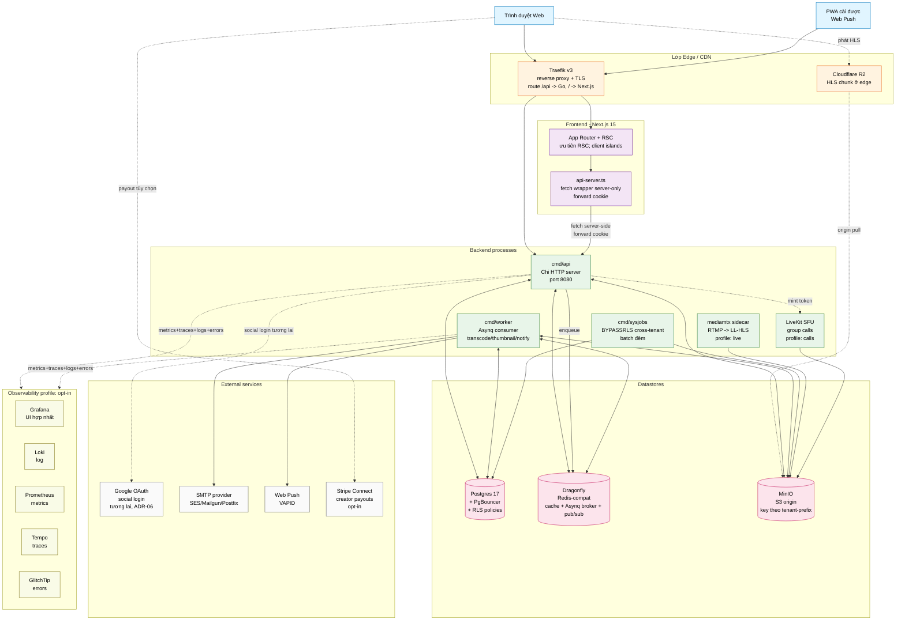
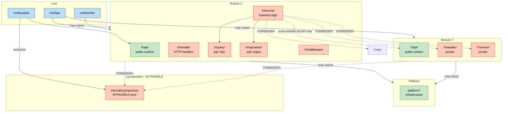
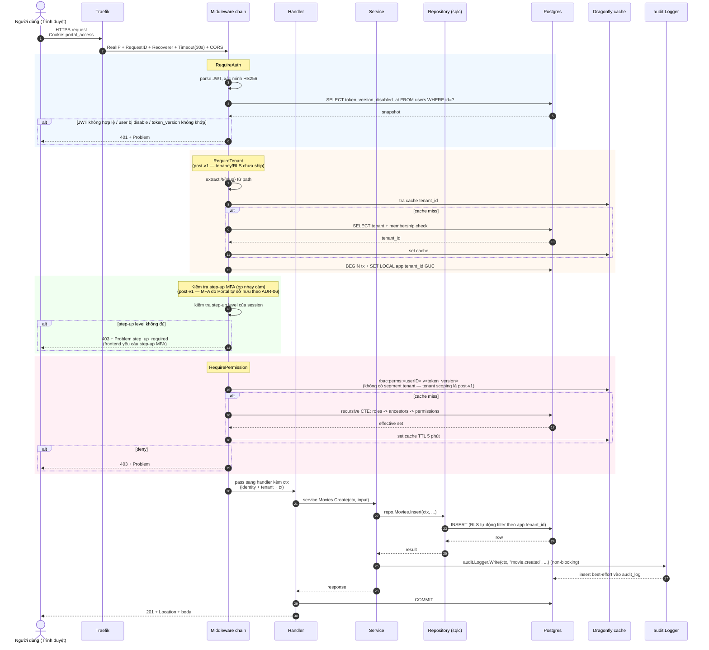
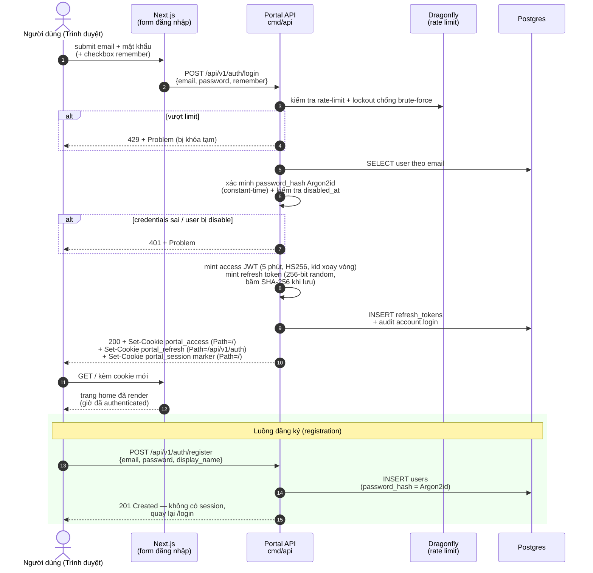

# Portal — Sơ đồ hệ thống

> **Trạng thái (2026-07-06):** Các sơ đồ này trộn lẫn hệ thống v1 đã ship với target dài hạn nhiều năm. v1 (đã ship) = xác thực mật khẩu local (ADR-06 — Authentik/OIDC bị loại bỏ hoàn toàn), slice upload media single-tenant → phát HLS, 8 compose service (postgres, pgbouncer, dragonfly, minio+minio-setup, traefik, api, worker, frontend), CI. Các phần gắn nhãn **[TARGET]** thể hiện thiết kế dài hạn; xem `MILESTONE_CHECKS.md` để biết trạng thái hiện hành và [doc/en/architecture/](architecture/) để biết phần cắt scope v1.

Bản đồ kiến trúc trực quan. Sơ đồ dùng Mermaid — render native trong GitHub, GitLab, VS Code preview, và `mermaid.live`. Source là text, nên diff được và version-controlled (không như export Miro/Figma).

Bảy view, mỗi cái trả lời một câu hỏi khác nhau:

1. **Landscape hệ thống** — service nào chạy và data flow giữa chúng ra sao.
2. **Bản đồ module backend** — cách chia modular monolith.
3. **Quy tắc boundary module** — cái gì được phép import cái gì.
4. **Flow request đã authenticate** — chuỗi middleware trên mọi endpoint protected.
5. **Sequence login mật khẩu local** — flow `/auth/login` (ADR-06).
6. **Flow upload + transcode asset** — pipeline media end-to-end.
7. **Phase roadmap** — thứ tự implementation.

---

## 1. Landscape hệ thống

View "Miro" — mọi component và mọi connection trong một cái nhìn.

```mermaid
graph TB
    classDef user fill:#e1f5ff,stroke:#0277bd,color:#000
    classDef edge fill:#fff3e0,stroke:#e65100,color:#000
    classDef frontend fill:#f3e5f5,stroke:#6a1b9a,color:#000
    classDef backend fill:#e8f5e9,stroke:#2e7d32,color:#000
    classDef datastore fill:#fce4ec,stroke:#c2185b,color:#000
    classDef external fill:#fafafa,stroke:#616161,color:#000
    classDef observability fill:#f9fbe7,stroke:#827717,color:#000

    Browser[Trình duyệt Web]:::user
    PWA[PWA cài được<br/>Web Push]:::user

    subgraph EDGE[Lớp Edge / CDN]
        direction TB
        R2[Cloudflare R2<br/>HLS chunk ở edge]:::edge
        Traefik[Traefik v3<br/>reverse proxy + TLS<br/>route /api -> Go, / -> Next.js]:::edge
    end

    subgraph FRONTEND[Frontend - Next.js 15]
        direction TB
        Next[App Router + RSC<br/>ưu tiên RSC; client islands]:::frontend
        APIServer[api-server.ts<br/>fetch wrapper server-only<br/>forward cookie]:::frontend
    end

    subgraph BACKENDPROC[Backend processes]
        direction TB
        CmdAPI[cmd/api<br/>Chi HTTP server<br/>port 8080]:::backend
        CmdWorker[cmd/worker<br/>Asynq consumer<br/>transcode/thumbnail/notify]:::backend
        CmdSysJobs[cmd/sysjobs<br/>BYPASSRLS cross-tenant<br/>batch đêm]:::backend
        MediaMTX[mediamtx sidecar<br/>RTMP -> LL-HLS<br/>profile: live]:::backend
        LiveKit[LiveKit SFU<br/>group calls<br/>profile: calls]:::backend
    end

    subgraph DATASTORES[Datastores]
        direction LR
        PG[(Postgres 17<br/>+ PgBouncer<br/>+ RLS policies)]:::datastore
        Dragonfly[(Dragonfly<br/>Redis-compat<br/>cache + Asynq broker + pub/sub)]:::datastore
        MinIO[(MinIO<br/>S3 origin<br/>key theo tenant-prefix)]:::datastore
    end

    subgraph EXT[External services]
        direction TB
        GoogleOAuth[Google OAuth<br/>social login<br/>tương lai, ADR-06]:::external
        SMTP[SMTP provider<br/>SES/Mailgun/Postfix]:::external
        WebPush[Web Push<br/>VAPID]:::external
        Stripe[Stripe Connect<br/>creator payouts<br/>opt-in]:::external
    end

    subgraph OBS[Observability profile: opt-in]
        direction LR
        Grafana[Grafana<br/>UI hợp nhất]:::observability
        Loki[Loki<br/>log]:::observability
        Prom[Prometheus<br/>metrics]:::observability
        Tempo[Tempo<br/>traces]:::observability
        GlitchTip[GlitchTip<br/>errors]:::observability
    end

    Browser --> Traefik
    PWA --> Traefik
    Browser -.phát HLS.-> R2
    R2 -.origin pull.-> MinIO

    Traefik --> Next
    Traefik --> CmdAPI
    Next --> APIServer
    APIServer -->|fetch server-side<br/>forward cookie| CmdAPI

    CmdAPI <--> PG
    CmdAPI <--> Dragonfly
    CmdAPI <--> MinIO
    CmdAPI -->|enqueue| Dragonfly
    CmdAPI -.social login tương lai.-> GoogleOAuth

    CmdWorker <--> Dragonfly
    CmdWorker <--> PG
    CmdWorker <--> MinIO
    CmdWorker --> SMTP
    CmdWorker --> WebPush

    CmdSysJobs --> PG
    CmdSysJobs --> MinIO

    MediaMTX --> MinIO
    LiveKit --> MinIO
    CmdAPI -.mint token.-> LiveKit

    CmdAPI -.metrics+traces+logs+errors.-> OBS
    CmdWorker -.metrics+traces+logs+errors.-> OBS

    Browser -.payout tùy chọn.-> Stripe
```

**Landscape [TARGET].** v1 đang chạy hôm nay: chỉ có 8 compose service (postgres, pgbouncer, dragonfly, minio+minio-setup, traefik, api, worker, frontend). Storage là single-tier — MinIO (dev, bind-mount `./data/minio`) / R2 (prod) theo ADR-04; origin-pull MinIO→R2 là thiết kế dài hạn, còn HLS playback ở v1 được proxy qua API (`GET /api/v1/assets/{id}/hls/*`). sysjobs, mediamtx, LiveKit, observability stack, Stripe, SMTP, và Web Push đều chưa được xây dựng. Authentik đã bị loại bỏ hoàn toàn (ADR-06); auth do Portal tự sở hữu bằng mật khẩu local, MFA sẽ do Portal tự sở hữu sau này.

**Flow chính được thể hiện:**

- **Path playback của user [TARGET]** — browser pull HLS chunk trực tiếp từ Cloudflare R2 (origin-pull từ MinIO khi cache miss). Tránh round-trip qua API. *(v1: playback đi qua HLS proxy của API.)*
- **Path API** — mọi request đã authenticate đều đi Browser → Traefik → API.
- **RSC fetch** — server component Next.js gọi API qua `api-server.ts` với cookie được forward, không bao giờ expose token cho JS phía browser.
- **Worker** — process độc lập; consume queue Asynq, hit Postgres + MinIO; emit notification qua SMTP + Web Push.
- **Service optional** — LiveKit (calls), mediamtx (live streaming), observability stack đều nằm sau flag `--profile` trong docker-compose; self-host single-VM có thể skip.

---

## 2. Bản đồ module backend

Modular monolith. Một family binary Go duy nhất, nhưng source tree được chia thành các bounded context.

```mermaid
graph TB
    classDef domain fill:#e3f2fd,stroke:#1565c0,color:#000
    classDef bridge fill:#fff8e1,stroke:#f57f17,color:#000
    classDef cross fill:#fce4ec,stroke:#ad1457,color:#000
    classDef plat fill:#e8eaf6,stroke:#283593,color:#000
    classDef cmd fill:#e0f2f1,stroke:#00695c,color:#000

    subgraph CMD[cmd - wiring layer]
        api[api<br/>HTTP server]:::cmd
        worker[worker<br/>Asynq consumer]:::cmd
        sysjobs[sysjobs<br/>BYPASSRLS]:::cmd
    end

    subgraph DOMAIN[Domain modules - internal/modules/]
        account[account<br/>auth + RBAC<br/>local password Argon2id + JWT]:::domain
        tenant[tenant<br/>orgs + memberships<br/>kind: org/household]:::domain
        media[media<br/>assets + transcode<br/>thumbnail workers]:::domain
        movie[movie<br/>catalog + episodes]:::domain
        music[music<br/>tracks + playlists]:::domain
        story[story<br/>chapters + drafts]:::domain
        comic[comic<br/>pages + readers]:::domain
        bank[bank<br/>double-entry ledger<br/>+ investments]:::domain
        notification[notification<br/>in-app + email + push]:::domain
        social[social<br/>posts + follows<br/>+ communities]:::domain
        creator[creator BRIDGE<br/>tips + subs]:::bridge
        marketplace[marketplace BRIDGE<br/>listings + escrow]:::bridge
        safety[safety<br/>NSFW + CSAM]:::cross
    end

    subgraph PLATFORM[Platform - internal/platform/]
        config[config<br/>env loader]:::plat
        db[db<br/>pgx + BeginTenantScope]:::plat
        cache[cache<br/>Redis + TenantKey]:::plat
        storage[storage<br/>S3 + tenant prefix]:::plat
        jobs[jobs<br/>Asynq client]:::plat
        realtime[realtime<br/>SSE + WebSocket<br/>Dragonfly pub/sub]:::plat
        mail[mail<br/>SMTP wrapper]:::plat
        audit[audit<br/>cross-cutting log]:::plat
        observability[observability<br/>OTel + Sentry]:::plat
        mw[middleware<br/>request-id + ratelimit<br/>+ tenant resolver]:::plat
    end

    api -->|MountHTTP| DOMAIN
    worker -->|RegisterTasks| DOMAIN
    sysjobs --> bank
    sysjobs --> tenant

    movie --> media
    music --> media
    story --> media
    comic --> media

    creator --> social
    creator --> bank

    marketplace --> social
    marketplace --> bank

    safety --> media
    safety --> social

    notification -.consumes notify:*.-> DOMAIN

    DOMAIN --> PLATFORM
    api --> mw
    worker --> jobs
```

**Hướng dẫn đọc:**

- **Trạng thái xây dựng (2026-07-06):** **đã build + đã wire** — `account`, `media`; **chỉ có scaffold** — `tenant`, `movie`, `music`, `story`, `comic` (`repository/` rỗng, chưa được construct trong `main.go`); **mới lên kế hoạch, chưa có code** — `bank`, `notification`, `social`, `creator`, `marketplace`, `safety`.
- **Domain modules** (xanh dương) — bounded context. Chỉ nói chuyện với nhau qua subpackage `api/`.
- **Bridge modules** (vàng) — `creator` và `marketplace` chủ ý span cả social lẫn bank.
- **Cross-cutting** (hồng) — `safety` consume event từ `media` + `social` để chạy classifier NSFW/CSAM/toxicity.
- **Platform** (chàm) — không có business logic; hạ tầng cross-cutting.
- **cmd/** (xanh ngọc) — chỉ wiring; construct mỗi module một lần và gọi `MountHTTP` / `RegisterTasks`.

Giao tiếp cross-module: đồng bộ qua call `<module>api.X(ctx, ...)`, bất đồng bộ qua event Asynq với naming `<emitting-module>:<event>`.

---

## 3. Quy tắc boundary module

Cái gì được phép import cái gì — convention theo [backend/MODULES.md](../../backend/MODULES.md) (authoritative); enforcement bằng `golangci-lint depguard` mới đang được lên kế hoạch — chưa có file `.golangci.yml` nào, và CI hiện chạy `go build`/`vet`/`test` + sqlc-drift, chưa chạy golangci-lint.

```mermaid
graph TB
    classDef allowed fill:#c8e6c9,stroke:#2e7d32,color:#000
    classDef restricted fill:#ffccbc,stroke:#bf360c,color:#000
    classDef wiring fill:#bbdefb,stroke:#0d47a1,color:#000

    subgraph CMDLAYER[cmd]
        cmdapi[cmd/api]:::wiring
        cmdworker[cmd/worker]:::wiring
        cmdsysjobs[cmd/sysjobs]:::wiring
    end

    subgraph MODX[Module X]
        Xapi[X/api/<br/>public surface]:::allowed
        Xhandler[X/handler/<br/>HTTP handlers]:::restricted
        Xservice[X/service/<br/>business logic]:::restricted
        Xquery[X/query/<br/>sqlc SQL]:::restricted
        Xrepo[X/repository/<br/>sqlc output]:::restricted
        Xmiddleware[X/middleware/]:::restricted
    end

    subgraph MODY[Module Y]
        Yapi[Y/api/<br/>public surface]:::allowed
        Yhandler[Y/handler/<br/>private]:::restricted
        Yservice[Y/service/<br/>private]:::restricted
    end

    subgraph PLAT[Platform]
        platall[platform/*<br/>infrastructure]:::allowed
    end

    subgraph SYSREPO[sysrepository - BYPASSRLS]
        sysrepo[internal/sysrepository<br/>BYPASSRLS pool]:::restricted
    end

    cmdapi -->|may import| MODX
    cmdapi -->|may import| MODY
    cmdworker --> MODX
    cmdsysjobs -->|exclusive| sysrepo
    cmdsysjobs --> Xapi

    MODX -->|may import| PLAT
    MODY -->|may import| PLAT
    Xservice -.cross-module via API only.-> Yapi

    Xservice -.FORBIDDEN.-> Yservice
    Xservice -.FORBIDDEN.-> Yrepo
    Xservice -.FORBIDDEN.-> Yhandler

    MODX -.FORBIDDEN.-> sysrepo
    MODY -.FORBIDDEN.-> sysrepo

    Xservice --> Xquery
    Xservice --> Xrepo
```

**Quy tắc cứng** (convention hiện tại; depguard-trong-CI mới lên kế hoạch):

| Caller | Được import | KHÔNG được import |
|---|---|---|
| `cmd/api`, `cmd/worker` | mọi module, `platform/*` | `internal/sysrepository` |
| `cmd/sysjobs` | `internal/sysrepository` (nơi duy nhất được phép!), package `api/` của module | — |
| `modules/X/service` | internal của module mình + `platform/*` + chỉ `api/` của module khác | `service/`, `handler/`, `repository/`, `query/`, package subdomain của module khác |
| Module bất kỳ | internal của mình + `platform/*` + `api/` của module khác | `internal/sysrepository` |

Quy tắc load-bearing duy nhất: **module chỉ nói chuyện với nhau qua package `api/`. Không bao giờ JOIN across table của nhau.**

---

## 4. Flow request đã authenticate

Chuỗi middleware trên mọi endpoint protected, với một nhánh error path được thể hiện.

**Chain v1 hiện tại:** RealIP → RequestID → Recoverer → Timeout → RequireAuth → RequirePermission. Các lớp tenant và step-up bên dưới là post-v1.

```mermaid
sequenceDiagram
    autonumber
    actor U as Người dùng (Trình duyệt)
    participant T as Traefik
    participant Mw as Middleware chain
    participant H as Handler
    participant S as Service
    participant R as Repository (sqlc)
    participant PG as Postgres
    participant Ca as Dragonfly cache
    participant Au as audit.Logger

    U->>T: HTTPS request<br/>Cookie: portal_access
    T->>Mw: RealIP + RequestID + Recoverer + Timeout(30s) + CORS

    rect rgb(240, 248, 255)
        Note over Mw: RequireAuth
        Mw->>Mw: parse JWT, xác minh HS256
        Mw->>PG: SELECT token_version, disabled_at FROM users WHERE id=?
        PG-->>Mw: snapshot
        alt JWT không hợp lệ / user bị disable / token_version không khớp
            Mw-->>U: 401 + Problem
        end
    end

    rect rgb(255, 248, 240)
        Note over Mw: RequireTenant<br/>(post-v1 — tenancy/RLS chưa ship)
        Mw->>Mw: extract /t/{slug} từ path
        Mw->>Ca: tra cache tenant_id
        alt cache miss
            Mw->>PG: SELECT tenant + membership check
            PG-->>Mw: tenant_id
            Mw->>Ca: set cache
        end
        Mw->>PG: BEGIN tx + SET LOCAL app.tenant_id GUC
    end

    rect rgb(240, 255, 240)
        Note over Mw: Kiểm tra step-up MFA (op nhạy cảm)<br/>(post-v1 — MFA do Portal tự sở hữu theo ADR-06)
        Mw->>Mw: kiểm tra step-up level của session
        alt step-up level không đủ
            Mw-->>U: 403 + Problem step_up_required<br/>(frontend yêu cầu step-up MFA)
        end
    end

    rect rgb(255, 240, 245)
        Note over Mw: RequirePermission
        Mw->>Ca: rbac:perms:<userID>:v<token_version><br/>(không có segment tenant — tenant scoping là post-v1)
        alt cache miss
            Mw->>PG: recursive CTE: roles -> ancestors -> permissions
            PG-->>Mw: effective set
            Mw->>Ca: set cache TTL 5 phút
        end
        alt deny
            Mw-->>U: 403 + Problem
        end
    end

    Mw->>H: pass sang handler kèm ctx<br/>(identity + tenant + tx)
    H->>S: service.Movies.Create(ctx, input)
    S->>R: repo.Movies.Insert(ctx, ...)
    R->>PG: INSERT (RLS tự động filter theo app.tenant_id)
    PG-->>R: row
    R-->>S: result
    S->>Au: audit.Logger.Write(ctx, "movie.created", ...) (non-blocking)
    Au-->>PG: insert best-effort vào audit_log
    S-->>H: response
    H->>PG: COMMIT
    H-->>U: 201 + Location + body
```

Mọi route protected đều đi qua các lớp này theo đúng thứ tự — ở v1 nghĩa là lớp auth + permission; tenant và step-up là post-v1. Khi tenancy được ship, RLS ở tầng database là **tuyến phòng thủ cuối cùng**: kể cả khi handler quên clause `WHERE tenant_id = ...`, Postgres vẫn từ chối trả về row.

---

## 5. Sequence login mật khẩu local

Flow `/auth/login` (ADR-06 — Portal tự sở hữu credential; Authentik/OIDC bị loại bỏ hoàn toàn). Từ "user submit form đăng nhập" tới "cookie session đã được set".

```mermaid
sequenceDiagram
    autonumber
    actor U as Người dùng (Trình duyệt)
    participant N as Next.js<br/>(form đăng nhập)
    participant A as Portal API<br/>cmd/api
    participant Rd as Dragonfly<br/>(rate limit)
    participant PG as Postgres

    U->>N: submit email + mật khẩu<br/>(+ checkbox remember)
    N->>A: POST /api/v1/auth/login<br/>{email, password, remember}

    A->>Rd: kiểm tra rate-limit + lockout chống brute-force
    alt vượt limit
        A-->>U: 429 + Problem (bị khóa tạm)
    end

    A->>PG: SELECT user theo email
    A->>A: xác minh password_hash Argon2id<br/>(constant-time) + kiểm tra disabled_at
    alt credentials sai / user bị disable
        A-->>U: 401 + Problem
    end

    A->>A: mint access JWT (5 phút, HS256, kid xoay vòng)<br/>mint refresh token (256-bit random,<br/>băm SHA-256 khi lưu)
    A->>PG: INSERT refresh_tokens<br/>+ audit account.login
    A-->>U: 200 + Set-Cookie portal_access (Path=/)<br/>+ Set-Cookie portal_refresh (Path=/api/v1/auth)<br/>+ Set-Cookie portal_session marker (Path=/)

    U->>N: GET / kèm cookie mới
    N-->>U: trang home đã render<br/>(giờ đã authenticated)

    rect rgb(240, 255, 240)
        Note over U,PG: Luồng đăng ký (registration)
        U->>A: POST /api/v1/auth/register<br/>{email, password, display_name}
        A->>PG: INSERT users<br/>(password_hash = Argon2id)
        A-->>U: 201 Created — không có session,<br/>quay lại /login
    end
```

Ba cookie với path khác nhau: `portal_access` (Path=/) và `portal_refresh` (Path=/api/v1/auth) là `HttpOnly Secure`; `portal_session` (Path=/) là một marker được Next.js middleware auth gate đọc. Việc tách path nghĩa là refresh token chỉ bao giờ đi tới các endpoint `/api/v1/auth/*`. `remember=true` → cookie persistent 24h (`REFRESH_TOKEN_TTL=24h`), ngược lại là cookie session. Rotation refresh-token + reuse detection (thu hồi cả chuỗi + audit event `auth.refresh.reuse_detected`) nằm trong các call `POST /auth/refresh` tiếp theo.

---

## 6. Flow upload + transcode asset

Pipeline media end-to-end cho thấy một video được upload trở thành HLS playback như thế nào.

```mermaid
sequenceDiagram
    autonumber
    actor U as Người dùng (Trình duyệt)
    participant A as cmd/api
    participant M as Object storage<br/>MinIO (dev) / R2 (prod)
    participant Q as Dragonfly<br/>(Asynq queue)
    participant W as cmd/worker<br/>(transcode handler)
    participant F as FFmpeg
    participant Sa as safety worker<br/>(D-38, đã lên kế hoạch)
    participant R as Cloudflare R2 CDN<br/>[TARGET] tầng edge

    U->>A: POST /api/v1/assets<br/>{filename, content_type}
    A->>A: RBAC: media:upload<br/>(quota theo tenant: post-v1)
    A->>A: INSERT assets (status=pending)
    A-->>U: 201 + asset_id<br/>+ presigned PUT URL

    alt upload qua presigned URL
        U->>M: PUT source object<br/>(presigned URL)
    else upload qua API proxy (dev)
        U->>A: PUT /api/v1/assets/{id}/source
        A->>M: PUT source object
    end

    U->>A: POST /api/v1/assets/{id}/complete
    A->>Q: Enqueue task transcode {asset_id}
    A-->>U: 202 Accepted

    Q->>W: giao task
    W->>A: UPDATE assets SET status=processing
    W->>M: download source
    W->>F: ffprobe source
    W->>F: ffmpeg VOD HLS<br/>h264/aac, một rendition duy nhất<br/>[TARGET: ladder 1080/720/480/360,<br/>NVENC/VAAPI]
    F-->>W: manifest + segments
    W->>M: upload assets/hls/{id}/*

    par Sinh thumbnail (stub ở v1 — chưa có output)
        W->>F: ffmpeg tạo poster + sprite
        F->>M: ghi thumbnail
    end

    W->>A: MarkAssetReady: UPDATE assets<br/>SET status=ready, hls_master_url, duration_ms
    W-->>Q: emit event media:asset_ready<br/>(đã lên kế hoạch — chưa emit ở v1, chưa có consumer;<br/>worker set status=ready trực tiếp)

    par Quét safety (Phase 12+, đã lên kế hoạch)
        Q->>Sa: consume media:asset_ready
        Sa->>Sa: chạy classifier nsfwjs + phash
        alt hash khớp CSAM
            Sa->>A: UPDATE assets SET status=quarantined
            Sa->>A: page operator qua webhook
        else NSFW > ngưỡng
            Sa->>A: UPDATE assets SET nsfw_flag=true
        end
    end

    Note over U,M: playback v1 — HLS proxy công khai qua API
    U->>A: GET /api/v1/assets/{id}/hls/*<br/>(Vidstack player)
    A->>M: fetch manifest / segment
    M-->>A: bytes
    A-->>U: HLS được serve qua API

    Note over M,R: [TARGET] replication async liên tục sang R2<br/>(ADR-04: môi trường deploy là R2-only single-tier)
    U->>R: [TARGET] GET HLS chunk từ edge
    R->>M: cache miss origin pull
    M-->>R: segments
    R-->>U: chunk được serve từ edge

    alt transcode fail 3 lần (design intent — dead-letter + asset_failed chưa implement ở v1)
        W->>Q: move sang transcode:dead
        W->>A: UPDATE assets SET status=failed, error_message
        W->>A: emit event media:asset_failed
    end
```

Flow này **non-blocking từ góc nhìn của user**: `/complete` trả về 202 và transcode chạy background; asset trở nên playable khi `assets.status=ready` (`GET /api/v1/assets/{id}`), rồi Vidstack play qua HLS proxy của API. Dead-letter queue cho failure là design intent, chưa được implement.

---

## 7. Phase roadmap

Thứ tự implementation với dependency gating.

```mermaid
graph LR
    classDef done fill:#c8e6c9,stroke:#2e7d32,color:#000
    classDef next fill:#bbdefb,stroke:#0d47a1,color:#000
    classDef later fill:#e0e0e0,stroke:#616161,color:#000

    P0[Phase 0<br/>Foundation wiring]:::done
    P1[Phase 1<br/>Tenancy + RLS]:::later
    P2[Phase 2<br/>Media pipeline]:::later
    P3[Phase 3<br/>Movies vertical]:::later
    P4[Phase 4<br/>Music/Stories/Comics<br/>+ progress + ratings]:::later
    P5pre[Phase 5 prereq<br/>step-up auth + MFA]:::later
    P5[Phase 5<br/>Bank 5a..5i<br/>ledger/debts/investments]:::later
    P6[Phase 6<br/>Notifications<br/>SSE + email + Web Push]:::later
    P7[Phase 7<br/>Social baseline<br/>newsfeed + follow + DM]:::later
    P8[Phase 8<br/>Search<br/>Postgres FTS]:::later
    P9[Phase 9<br/>Marketing microsite<br/>+ blog + badges]:::later
    P10[Phase 10<br/>Social advanced<br/>stories + reels + live]:::later
    P11[Phase 11<br/>Creator economy<br/>tips + subs + payouts]:::later
    P12[Phase 12<br/>Marketplace + ML safety<br/>+ voice/video calls]:::later

    P0 --> P1
    P1 --> P2
    P2 --> P3
    P3 --> P4
    P0 -.prereq.-> P5pre
    P5pre --> P5
    P4 --> P6
    P5 --> P6
    P6 --> P7
    P7 --> P8
    P7 --> P10
    P9 -.parallel.-> P0
    P10 --> P11
    P5 --> P11
    P11 --> P12
    P10 --> P12
```

> **Cập nhật (2026-07-06):** Phase 0 đã hoàn thành (migration 0001–0007, sqlc, repository adapter, account + media đã wire trong `cmd/api`, healthz xanh). v1 còn ship thêm một happy path upload media→HLS single-tenant — một subset của Phase 2 được lấy trước Phase 1 tenancy theo [01-v1-scope-cut.md](architecture/01-v1-scope-cut.md) — cộng với CI. Nội dung phase là authoritative trong [feature.md](feature.md); sơ đồ này chỉ track dependency.

**Quy tắc gate:**

- Tiêu chí exit của Phase N phải đạt được trước khi Phase N+1 mở.
- Phase 5 (bank) bị gate bởi một sub-phase prereq tường minh, land step-up auth + MFA enforcement trước (MFA do Portal tự sở hữu theo ADR-06 — không có IdP bên ngoài) — money operation không thể ship nếu thiếu những thứ này.
- Phase 9 (microsite) đủ độc lập để ship song song với bất kỳ phase nào khác một khi Phase 0 đã xong.
- Phase 10–12 build trên bộ ba social + creator + bank.

---

## Nguồn sơ đồ

Tất cả sơ đồ dùng cú pháp Mermaid 10+. Để preview:

- **GitHub**: render native khi xem file này.
- **VS Code**: cài extension "Markdown Preview Mermaid Support".
- **Live edit**: paste code-block bất kỳ vào [mermaid.live](https://mermaid.live).
- **Export PNG/SVG**: dùng Mermaid CLI (`@mermaid-js/mermaid-cli`) hoặc nút download của `mermaid.live`.

Updates: edit in place. Sơ đồ là một phần của cùng git diff với code change — nếu module được thêm hoặc flow thay đổi, update sơ đồ tương ứng trong cùng PR.
