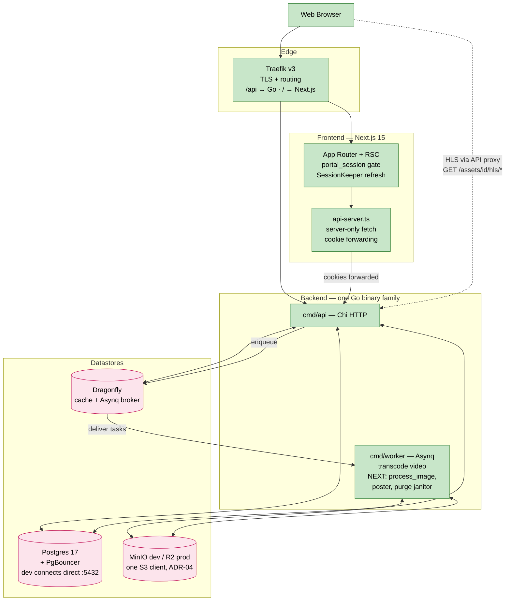
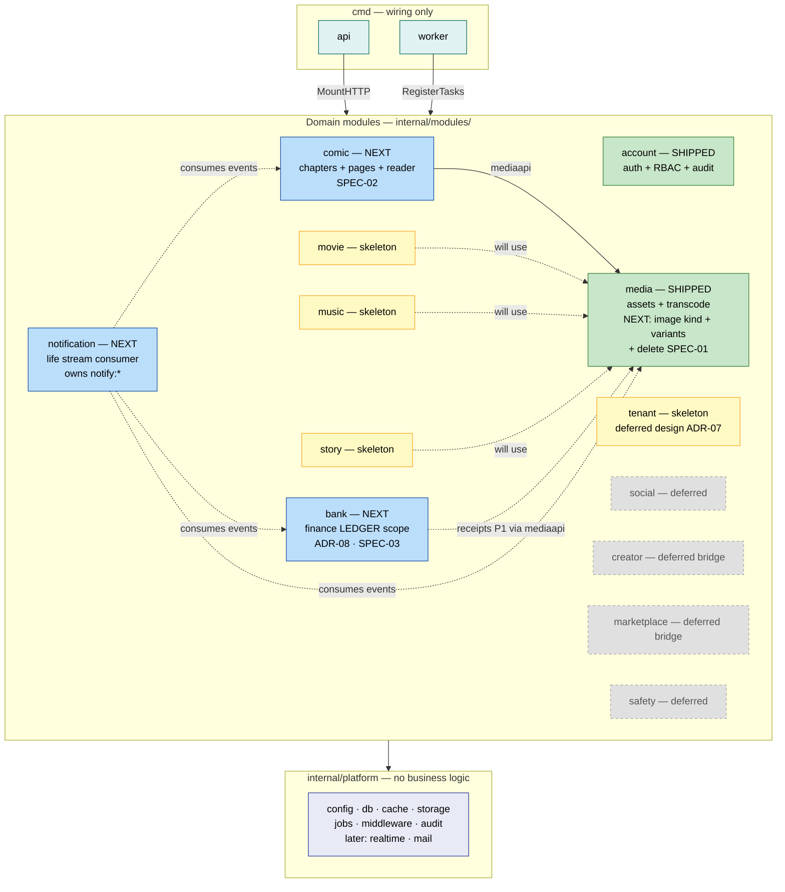
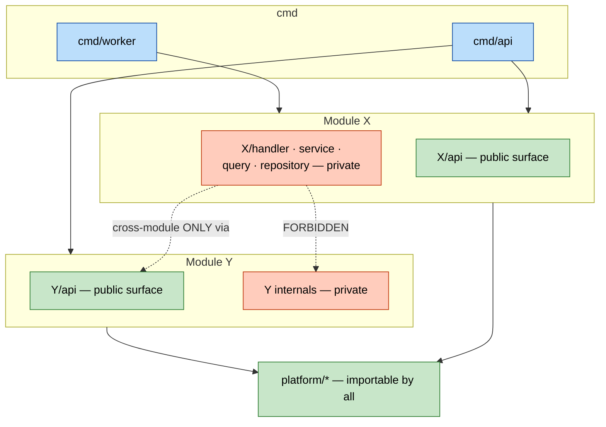
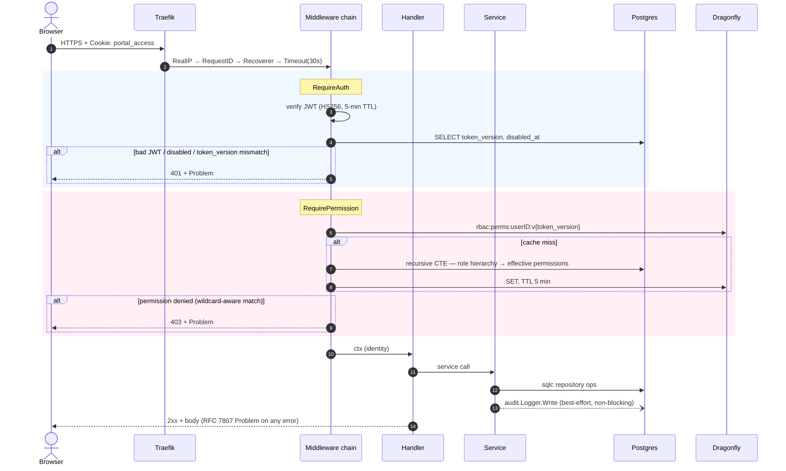
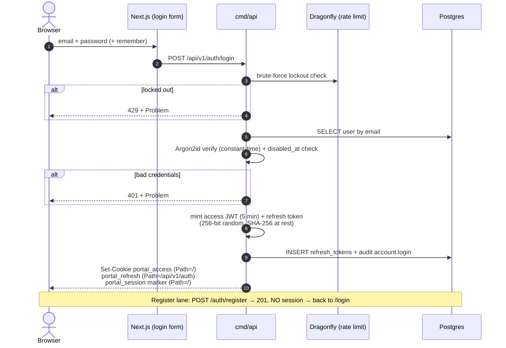
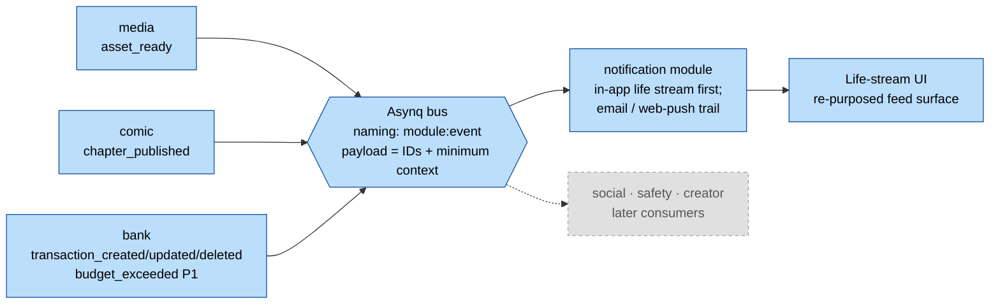
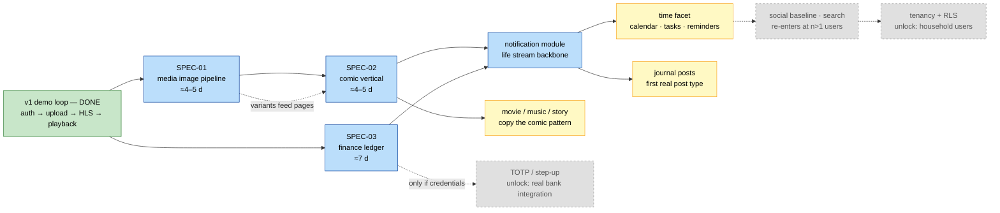

# Portal — System Diagrams

**Status:** current · **Last verified:** 2026-07-07
**Narrative companion:** [overview.md](overview.md) · live status: [`/MILESTONE_CHECKS.md`](../../MILESTONE_CHECKS.md)

Visual architecture map in Mermaid (renders on GitHub/GitLab/VS Code/mermaid.live;
diffable, version-controlled).

**Tier legend — used consistently in every diagram:**

| Style | Tier | Meaning |
|---|---|---|
| green | **SHIPPED** | running today, verifiable on the stack |
| blue | **NEXT** | committed + specified (SPEC-01…03, notification — ADR-08 order) |
| grey, dashed | **DEFERRED** | designed, explicitly out of scope (ADR-01; re-entry conditions in [briefs/04](../product/briefs/04-deferred.md)) |

Eight views:

1. [System landscape](#1-system-landscape) — services and data flows
2. [Backend module map](#2-backend-module-map) — the modular monolith split
3. [Module boundary rules](#3-module-boundary-rules) — what may import what
4. [Authenticated request flow](#4-authenticated-request-flow) — the middleware chain
5. [Local password login](#5-local-password-login-sequence) — `/auth/login` (ADR-06)
6. [Media pipeline](#6-media-pipeline-video--image) — video + image (SPEC-01)
7. [Life-stream event flow](#7-life-stream-event-flow) — the ADR-08 integration seam
8. [Roadmap](#8-roadmap) — ADR-08 build order

---

## 1. System landscape

What actually runs (SHIPPED) plus the committed additions (NEXT). The long-horizon
extras (CDN edge tier, LiveKit, mediamtx, observability stack, Stripe, sysjobs)
are DEFERRED and intentionally **not drawn** — see
[deferred/multi-tenant-backend.md](deferred/multi-tenant-backend.md) and
[briefs/04](../product/briefs/04-deferred.md) for those designs.



**Flows worth naming:**

- **Playback (SHIPPED)** goes through the API HLS proxy — *not* a CDN. Direct-edge
  playback is deferred with the CDN tier.
- **RSC fetches** never expose tokens to browser JS: server components call the API
  through `api-server.ts` with cookies forwarded (D-34).
- **Uploads (dev)** are API-proxied; presigned direct-to-bucket is a deferred item.
- **Vidstack loads hls.js from a CDN** → playback needs internet even locally
  (backlog: bundle it).

---

## 2. Backend module map

One binary family; source tree split into bounded contexts under
`internal/modules/`. Status per tier; `bank` is drawn with its **ADR-08 ledger
scope**, not the old full-§8 ambition.



**Reading guide.** Blue is the current commitment (build order: media additions →
comic → bank → notification). Skeleton modules exist in-tree but are not
constructed in `main.go`; movie/music/story wait for comic to prove the vertical
pattern. Deferred modules are drawn only to show which seams they will plug into.
Cross-module communication: sync `<module>api.X(ctx, …)`, async Asynq
`<module>:<event>` — inventory in [reference/events.md](../reference/events.md).

---

## 3. Module boundary rules

Convention per [MODULES.md](../../backend/MODULES.md) (authoritative). depguard
enforcement in CI is **planned, not present** — the rules hold by discipline today.



| Caller | May import | Must NOT import |
|---|---|---|
| `cmd/api`, `cmd/worker` | every module, `platform/*` | — |
| `modules/X` (any package) | own internals, `platform/*`, other modules' `api/` **only** | other modules' `service/handler/repository/query` |

The single load-bearing rule: **modules talk only through `api/` packages and
events; they never JOIN across each other's tables** — and, by extension, never
FK across module boundaries (asset references in `comic_pages`/`bank_transactions`
are plain UUIDs validated through `mediaapi`).

*(`cmd/sysjobs` + `internal/sysrepository`/BYPASSRLS rows from the old diagram
belong to the deferred multi-tenant design — see
[deferred/multi-tenant-backend.md](deferred/multi-tenant-backend.md).)*

---

## 4. Authenticated request flow

The SHIPPED middleware chain. The old diagram's tenant-resolution and step-up
blocks were post-v1 design; they now live with the deferred docs, leaving the
chain that actually runs.



Revocation has two channels: `token_version` bump invalidates all JWTs + the RBAC
cache key in one move; refresh-token rotation with reuse detection revokes the
chain (details: [security.md](security.md)). NEXT-tier note: the built-but-unmounted
IP rate-limiter should be wired onto `/auth/*` (backlog §7). Step-up/TOTP joins
this chain only when a credential-holding bank feature is scheduled (ADR-08).

---

## 5. Local password login sequence

ADR-06 — Portal owns credentials; Authentik/OIDC removed entirely. Unchanged and
accurate as shipped.



Cookie path split keeps the refresh token off every route except `/api/v1/auth/*`.
`remember=true` → 24 h persistent cookies; otherwise session cookies. Rotation +
reuse detection (chain revocation + `auth.refresh.reuse_detected` audit) happen in
`POST /auth/refresh`.

---

## 6. Media pipeline (video + image)

The SHIPPED video path plus the NEXT image branch and lifecycle ops from
[SPEC-01](../product/specs/SPEC-01-media-image-pipeline.md). One dispatch seam:
kind decides the worker task.

```mermaid
sequenceDiagram
    autonumber
    actor U as Browser
    participant A as cmd/api
    participant S3 as MinIO / R2
    participant Q as Asynq (Dragonfly)
    participant W as cmd/worker
    participant F as FFmpeg

    U->>A: POST /api/v1/assets {filename, content_type}
    A->>A: RBAC media:upload · sniff MIME (magic bytes)
    A->>A: INSERT assets (kind, status=pending)
    A-->>U: 201 + asset_id
    U->>A: PUT source (API-proxied in dev)
    A->>S3: PUT original
    U->>A: POST /assets/{id}/complete → 202

    alt kind = video — SHIPPED
        A->>Q: enqueue media:transcode
        Q->>W: deliver
        W->>F: ffprobe → ffmpeg h264/aac single-rendition HLS
        W->>S3: upload playlist + segments
        W->>F: NEXT SPEC-01: extract poster frame<br/>(min(10% duration, 10s), 640w WebP)
        W->>S3: NEXT: poster variant
    else kind = image — NEXT SPEC-01
        A->>Q: enqueue media:process_image
        Q->>W: deliver
        W->>F: probe (reject animated / >12k px)<br/>auto-orient → strip metadata
        W->>F: variants: thumb 320w · medium 1280w (WebP q~80)
        W->>S3: upload variants + cleaned original
    end

    W->>A: UPDATE assets SET status=ready
    W--)Q: NEXT: emit media:asset_ready<br/>(life-stream producer #1)

    Note over U,S3: Playback/serve — SHIPPED: HLS via API proxy;<br/>NEXT: images served from variant URLs (reader uses medium, grid uses thumb)

    rect rgb(240, 248, 255)
        Note over U,S3: NEXT SPEC-01 — delete lifecycle
        U->>A: DELETE /api/v1/assets/{id} (media:asset:delete:own)
        A->>A: status=deleting (hidden from listings)
        A->>S3: purge all keys (original, HLS, variants)
        A->>A: delete rows · idempotent 404 on repeat
        Note over A,W: media:purge_orphans janitor retries partial failures
    end

    alt processing fails
        W->>A: status=failed + error_message (never crash the worker)
    end
```

Failure semantics worth stating: video **poster** failure does not fail the asset
(playback > cosmetics); image **processing** failure does fail it (there is
nothing to serve). The old diagram's safety-scan and CDN-edge lanes are DEFERRED
and documented with their designs, not here.

---

## 7. Life-stream event flow

The ADR-08 integration seam: domain modules publish facts; the notification module
(NEXT #4) is the first consumer, folding them into the user's life stream. Emitting
with zero consumers is deliberate groundwork, not dead code.



Rules (from [reference/events.md](../reference/events.md)): events are past-tense
facts; consumers fetch details via `api/` packages — payloads are not documents;
`notify:*` is the notification module's reserved namespace; whether `bank:*`
amounts are *displayed* is the consumer's decision, not the payload's.

---

## 8. Roadmap

ADR-08 replaced the old phase ladder (which gated everything behind tenancy and
bank behind MFA). Old Phase numbers remain in
[feature-inventory](../product/feature-inventory.md) as historical cross-references;
**this diagram is the build order of record.**



**Gate rules (new):**

- SPEC-03 is **not** gated on MFA (ledger holds no credentials — ADR-08); TOTP
  re-enters only with credential-holding bank features.
- The notification module waits for at least two event producers to exist
  (SPEC-02 + SPEC-03) so the life stream launches non-empty.
- movie/music/story open only after SPEC-02 proves the vertical pattern.
- Social/search re-enter with real second users; tenancy with household users —
  re-entry conditions live in [briefs/04](../product/briefs/04-deferred.md).

---

## Diagram source

Mermaid 10+. Preview: GitHub native, VS Code "Markdown Preview Mermaid Support",
or [mermaid.live](https://mermaid.live). **Diagrams change in the same PR as the
code they depict**; when a spec ships, recolor its nodes to SHIPPED rather than
deleting history.
